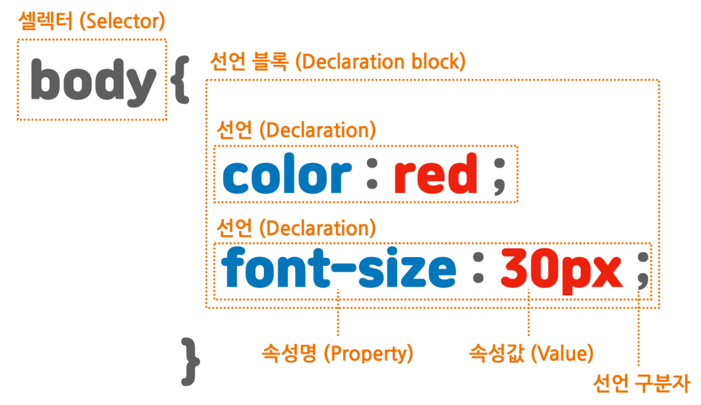

# CSS 기초

## 목차

[1. CSS](#1-css)

[2. CSS 문법 구성](#2-css-문법-구성)

  - [2.1. Tag Selector](#21-tag-selector)
  - [2.2. Id Selector](#22-id-selector)
  - [2.3. Class Selector](#23-class-selector)

[3. CSS 적용 방법](#3-css-적용-방법)

  - [3.1. 인라인 스타일](#31-인라인-스타일)
  - [3.2. 내부 스타일 시트](#32-내부-스타일-시트)
  - [3.3. 외부 스타일 시트](#33-외부-스타일-시트)

[4. 캐스케이딩(Cascading)](#4-캐스케이딩cascading)

## 1. CSS

CSS는 Cascading Style Sheets의 약자로 디자인 요소를 시각화하는 스타일 시트 언어이다.

## 2. CSS 문법 구성



셀렉터는 태그 이름이나 id 또는 class를 선택한다.<br>
셀렉터로 특정 요소를 선택했다면 중괄호 안에서 이 요소에 적용할 내용을 작성한다.<br>
속성과 속성값의 끝에는 세미콜론(;)을 붙여 속성끼리 구분한다.

### 2.1. Tag Selector

CSS를 body, div, button 등 특정 태그에만 적용하기 위해서는 Tag Selector를 사용한다.

### 2.2. Id Selector

id는 문서 내에 단 하나의 요소에만 적용할 수 있는 유일한 이름으로 CSS를 특정 요소에 적용하기 위해서는 Id Selector를 사용한다.

사용 방법은 Selector 앞에 '#'을 붙인다.

### 2.3. Class Selector

동일한 기능을 하는 CSS를 여러 요소에 적용하기 위해서는 Class Selector를 사용한다.

사용 방법은 Selector 앞에 '.'을 붙인다.

## 3. CSS 적용 방법

HTML 문서에 CSS를 적용하는 방법에는 인라인 스타일, 내부 스타일 시트, 외부 스타일 시트가 존재한다.

### 3.1. 인라인 스타일

인라인 스타일은 HTML 요소 내부에 style 속성을 사용하여 CSS를 적용하는 방법이다.

```
<div style="color: red; background-color: yellow;">인라인 스타일</div>
```

### 3.2. 내부 스타일 시트

내부 스타일 시트는 HTML 문서의 head 태그 내부에 style 태그를 사용하여 CSS를 적용하는 방법이다.

```
<head>
  <style>
    div {
      color: red;
      background-color: yellow;
    }
  </style>
</head>
```

### 3.3. 외부 스타일 시트

외부 스타일 시트는 외부에 작성된 CSS 파일을 head 태그 내부에 link 태그를 사용하여 CSS를 적용하는 방법이다.

```
<head>
  <link rel="stylesheet" href="파일 경로">
</head>
```

## 4. 캐스케이딩(Cascading)

CSS에서 사용되는 캐스케이딩의 의미는 어떤 스타일을 적용 받을지에 대한 우선순위를 뜻한다.

우선순위는 아래와 같으며 코드 순서는 늦게 선언된 스타일이 우선 적용 된다.

1. 인라인 스타일 시트
2. 내부 스타일 시트
3. 외부 스타일 시트
4. 웹 브라우저 기본 스타일