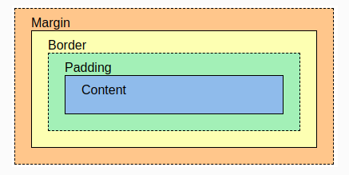
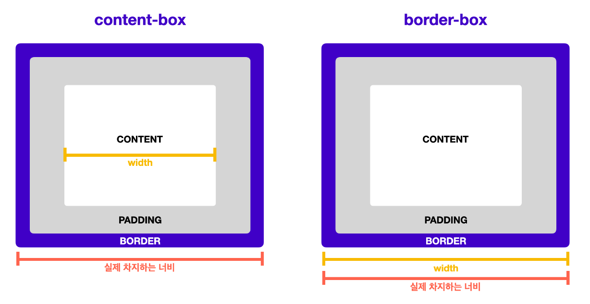

# CSS 박스 모델

## 목차

[1. 박스](#1-css-박스)

[2. 박스의 종류](#2-박스의-종류)

[3. 박스 구성 요소](#3-박스-구성-요소)

[4. Overflow](#4-overflow)

[5. Box-sizing](#5-box-sizing)
  - [5.1. content-box](#51-content-box)
  - [5.2. border-box](#52-border-box)

## 1. 박스

모든 컨텐츠는 각자의 영역을 가지며 일반적으로 하나의 컨텐츠로 묶이는 요소들이 하나의 박스가 된다.

박스는 항상 직사각형이고 너비와 높이를 가지며 CSS를 이용해 크키를 설정한다.

## 2. 박스의 종류

박스의 종류는 줄바꿈이 되는 block 박스와 줄바꿈이 없이 옆으로 붙는 inline 박스로 구분할 수 있다.<br>
그리고 이 두 가지 박스 특징이 섞인 inline-block 박스도 있다.

||block|inline|inline-block|
|---|---|---|---|
|줄 바꿈|일어남|일어나지 않음|일어나지 않음|
|기본 너비|100%|글자가 차지하는 만큼|글자가 차지하는 만큼|
|width, height|사용 가능|사용 불가능|사용 가능|
|예|div, p|span, input|{ display: inline-block }|

## 3. 박스 구성 요소

Border(테두리)를 기준으로 Padding(안쪽 여백)과 Margin(바깥 여백)이 있다.



## 4. Overflow

요소의 컨텐츠가 너무 커서 요소의 박스 서식에 맞출 수 없을 때의 처리방법을 설정하는 속성으로 속성값은 hidden, visible, auto, scroll 등이 있다.

> hidden

박스를 넘어가는 컨텐츠를 보여주지 않는다.

> visible

박스를 넘어가는 컨텐츠를 보여준다.

> auto

컨텐츠가 박스를 넘어가는 경우 스크롤을 생성하여 보여준다.

> scroll

컨텐츠가 박스를 넘어가지 않던 넘어가던 스크롤을 항상 생성한다.

## 5. Box-sizing

박스의 너비와 높이를 계산하는 방법을 지정하는 속성으로 속성값은 content-box, border-box가 있으며 기본값은 content-box이다.



box-sizing을 일부 요소에만 적용하는 경우 혼란을 가중시킬 수 있으므로 일반적으로 HTML 문서 전체에 적용한다.

```
* {
  box-sizing: border-box;
}
```

### 5.1. content-box

박스의 크기를 측정하는 기본값으로 width와 height 속성이 컨텐츠 영역만 포함하고 여백과 테두리 두께는 포함하지 않는다.

### 5.2. border-box

안쪽 여백(padding)과 테두리 두께를 포함한 박스 크기를 측정하는 속성값이다.