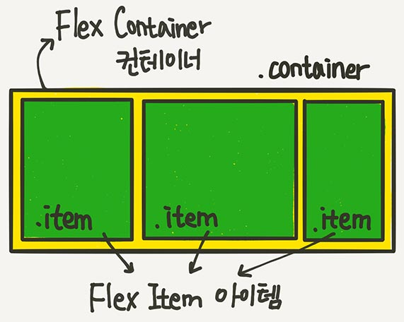
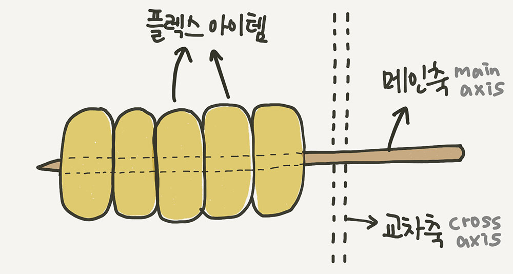
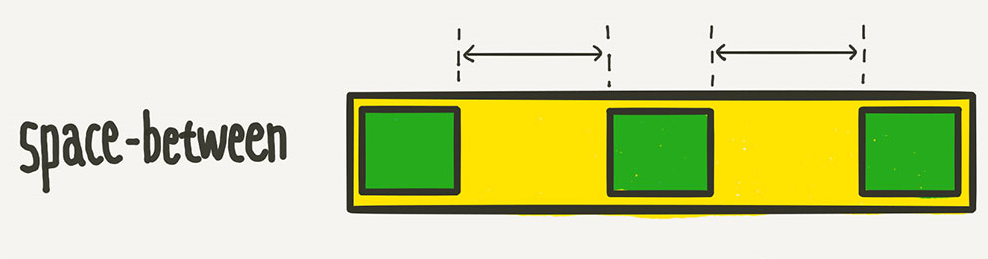
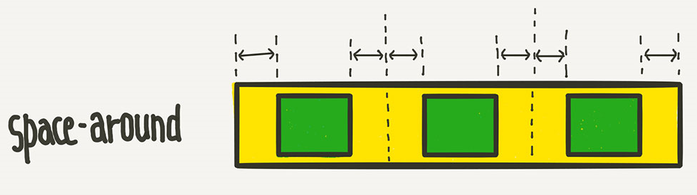
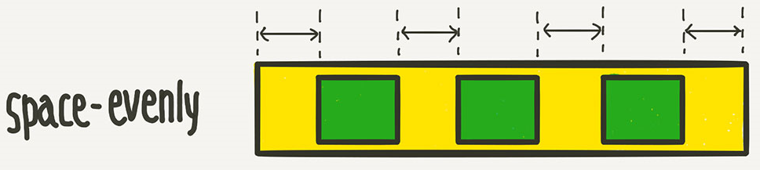
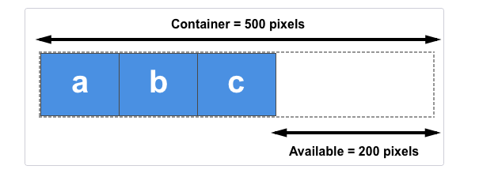

# TIL: CSS Flexbox

Flexbox 또는 Flex, Flexible Box라고 부르며 레이아웃 배치 전용 기능으로 고안되었다.

## 목차

[1. 레이아웃](#1-레이아웃)
- [1.1. 수직분할](#11-수직분할)
- [1.2. 수평분할](#12-수평분할)

[2. 레이아웃 리셋](#2-레이아웃-리셋)

[3. Flexbox](#3-flexbox)
- [3.1. Flexbox 축(axis)](#31-flexbox-축axis)

[4. Flexbox 적용 방법](#4-flexbox-적용-방법)
- [4.1. flex-direction](#41-flex-direction)
- [4.2. flex-wrap](#42-flex-wrap)
- [4.3. 축 방향 정렬](#43-축-방향-정렬)
- [4.4. flex](#44-flex)

## 1. 레이아웃

레이아웃이란 특정 공간에 여러 구성 요소를 보기 좋게 효과적으로 배치하는 작업을 의미한다.

CSS로 레이아웃을 작업할 때에는 수직분할과 수평분할을 차례대로 적용하여 컨텐츠의 흐름에 따라 작업을 진행한다.

### 1.1. 수직분할

화면을 수직으로 구분하여 컨텐츠가 가로로 배치될 수 있도록 요소를 배치한다.

### 1.2. 수평분할

화면을 수평으로 구분하여 컨테츠가 세로로 배치될 수 있도록 요소를 배치한다.

## 2. 레이아웃 리셋

HTML 문서는 기본적인 스타일을 가지고 있으며 때때로 이 기본적인 스타일이 레이아웃을 설정하는데 방해가 되기도 한다.<br>
이러한 상황을 방지하기 위해 라이브러리를 사용하거나 기본 스타일링을 제거하는 방법을 레이아웃 리셋이라고 한다.

```
* { box-sizing: border-box; }

body {
  margin: 0;
  padding: 0;
}
```

## 3. Flexbox

Flexbox는 행과 열 형태로 요소들을 배치하는 일차원 레이아웃 메서드로 요소들은 부족한 공간에 맞추기 위해 축소되거나 여분의 공간을 채우기 위해 변형될 수 있다.

부모 요소를 Flex Container라고 부르고 자식 요소들을 Flex Item이라고 부른다.



### 3.1. Flexbox 축(axis)

Flexbox를 원하는 대로 제어하기 위해서는 축(axis)에 대한 정의를 알아야 한다.<br>
축(axis)은 주축(main axis)과 교차축(cross axis)으로 구분한다.



> 주축(main axis)

주축은 flex-direction 속성에 의해서 결정된다. (flex-direction에 대한 설명은 아래 4.1. 참고)

수직분할 형태이면 주축은 인라인 방향(가로 축)이 되며 수평분할 형태이면 주축은 블록 방향(세로 축)이 된다.

> 교차축(cross axis)

교차축은 주축과 수직을 이루는 방향으로 주축이 인라인 방향(가로축)이면 교차축은 열 방향(세로축)이 되며 주축이 블록 방향(세로축)이면 교차축은 행 방향(가로축)이 된다.

## 4. Flexbox 적용 방법

Flexbox의 속성은 크게 Flex Container에 적용하는 속성과 Flex Item에 적용하는 속성 두 가지로 나뉜다.<br>
Flexbox를 적용 하려면 부모 요소(Flex Container)에 아래와 같은 CSS를 적용하면 된다.

```
부모 요소 {
  display: felx;
}
```

Flexbox가 적용된 부모 요소는 수직분할이 기본 값으로 자식 요소(Flex Item)들은 왼쪽 부터 차례대로 배치된다.

### 4.1. flex-direction

flex-direction 속성은 자식 요소(Flex Item)들이 배치되는 축의 방향을 결정하는 속성으로 row, column, row-reverse, column-reverse과 같은 속성 값이 있으며 부모 요소(Flex Container)에 CSS를 적용한다.

> row

기본 값으로 수직분할의 형태로 자식 요소는 왼쪽부터 오른쪽으로 차례대로 배치된다.

> column

수평분할의 형태로 자식 요소는 위에서부터 아래로 차례대로 배치된다.

> row-reverse

수직분할의 형태이지만 row와 반대로 자식 요소는 오른쪽부터 왼쪽으로 차례대로 배치된다.

> column-reverse

수평분할의 형태이지만 column과 반대로 자식 요소는 아래에서부터 위로 차례대로 배치된다.

### 4.2. flex-wrap

flex-wrap 속성은 Flexbox의 아이템들이 강제로 한줄에 배치되게 할 것인지 또는 여러 행에 나누어 배치되도록 할 것인지 결정하는 속성이다.

속성 값으로는 nowrap, wrap, wrap-reverse가 있으며 시작점은 flex-direction에 의해 결정된 방향으로 적용된다.

> nowrap

기본 값으로 줄바꿈을 하지 않고 Flexbox의 아이템들이 Flexbox의 컨테이너를 벗어나더라도 강제로 한줄에 배치한다.

> wrap

Flexbox의 아이템들이 Flexbox의 컨테이너를 벗어나면 줄바꿈을 하여 여러 행에 나누어 배치한다.

> wrap-reverse

wrap 속성 값과 동일하지만 Flexbox의 아이템들이 나열되는 시작점과 끝점의 기준이 반대로 배치된다.<br>
즉, 줄바꿈이 일어날때 줄바꿈이 역으로 일어난다.

### 4.3. 축 방향 정렬

Flexbox의 축들을 기준으로 아이템을 정렬할 수 있는 속성에는 justify-content와 align-items가 있다.

#### 4.3.1. justify-content

justify-content 속성은 아이템들을 주축(main axis)을 기준으로 정렬할 수 있다.

속성 값으로는 flex-start, flex-end, center, space-between, space-around, space-evenly가 있다.

> flex-start

기본 값으로 Flexbox의 아이템들을 시작점부터 정렬한다.

> flex-end

Flexbox의 마지막 아이템이 끝선을 기준으로 아이템들을 정렬한다.

> center

Flexbox의 아이템들을 가운데로 정렬한다.

> space-between

사용 가능한 공간을 Flexbox의 아이템과 아이템 사이의 공간에 균일하게 배분한다.



> space-around

사용 가능한 공간을 Flexbox의 아이템과 아이템 사이 및 시작점과 끝선을 합친 공간에 균일하게 배분한다.



> space-evenly

사용 가능한 공간을 Flexbox의 아이템과 아이템 사이 및 시작점과 끝선의 공간에 균일하게 배분한다.



#### 4.3.2. align-items

align-items 속성은 아이템들을 교차축(cross axis)을 기준으로 정렬할 수 있다.

속성 값으로는 stretch, flex-start, flex-end, center가 있다.

> stretch

기본 값으로 Flexbox의 아이템들을 교차축 방향으로 Flexbox의 컨테이너를 가득 채운다.

> flex-start

Flexbox의 아이템들을 교차축 방향의 시작선에 정렬한다.<br>
즉, 교차축이 세로 축이면 위, 가로 축이면 왼쪽에 정렬한다.

> flex-end

Flexbox의 아이템들을 교차축 방향의 끝선에 정렬한다.

> center

Flexbox의 아이템들을 교차축의 가운데에 정렬한다.

### 4.4. flex

지금 까지 부모 요소(Flex Container)에 속성과 속성 값을 부여하여 자식 요소(Flex Item)에 영향을 주었다면 flex는 자식 요소(Flex Item)에 적용하는 속성이다.

flex 속성을 사용하면 아이템을 필요에 따라 늘리거나 줄일 수 있다.

```
{ flex: grow shrink basis; }
```

사용 방법은 위와 같으며 grow, shrink, basis는 각각 팽창 지수, 수축 지수, 기본 크기를 의미하며 flex 속성을 따로 주지 않으면 각각 0, 1, auto의 기본 값이 적용 된다.

flex의 grow, shrink, basis는 아래와 같이 따로 값을 지정할 수도 있다.

```
자식 요소(Flex Item) {
  flex-grow: 0;
  flex-shrink: 1;
  flex-basis: auto;
}
```

> grow

grow 속성값은 단위가 없고 비율에 따라 박스 크기가 늘어난다.



사용 가능한 공간(Available)을 부모 요소(Flex Container)의 자식 요소(Flex Item)에 적용된 grow 값의 총합으로 나누어 주어진 비율만큼 할당한다.

> shrink

grow와 반대로 설정한 비율만큼 박스 크기가 줄어든다.

grow 속성과 shrink 속성을 함께 사용하여 레이아웃을 지정하는 일은 추천하지 않고 grow 속성을 이용하는 방식을 권장한다.

> basis

basis 속성 값은 박스 요소의 크기를 결정하며 기본 값은 auto이다.

basis는 grow 값이 0인 경우에만 basis 속성의 값이 유지되며 width와 동시에 적용하는 경우 basis가 우선된다.