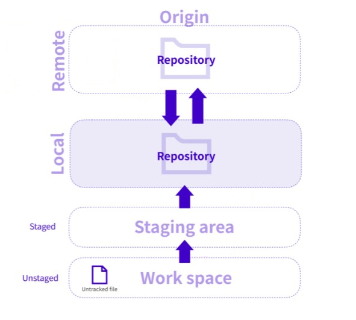
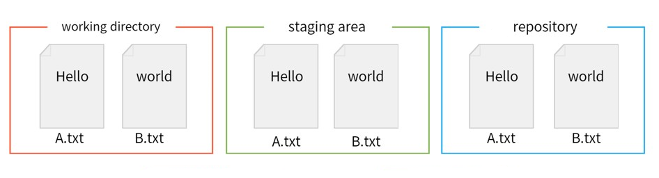
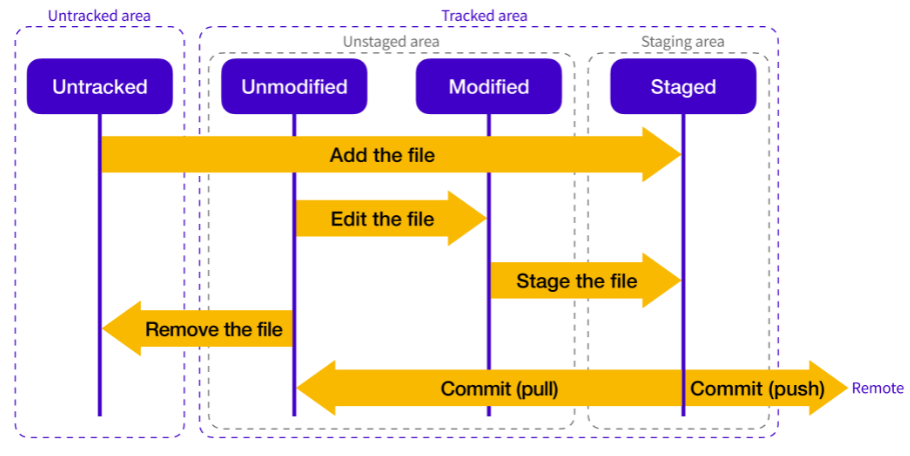

# Git

## 목차

[1. Git](#1-git)
- [1.1. 분산형 버전 관리 시스템(DVCS)](#11-분산형-버전-관리-시스템dvcs)
- [1.2. 브랜치(Branch)](#12-브랜치branch)
- [1.3. 스테이징 영역(Staging Area)](#13-스테이징-영역staging-area)
- [1.4. 원격 저장소(Remote Repository)](#14-원격-저장소remote-repository)

[2. Git Repository](#2-git-repository)
- [2.1. Remote Repository](#21-remote-repository)
- [2.2. Local Repository](#22-local-repository)

[3. Git의 영역 및 파일의 상태](#3-git의-영역-및-파일의-상태)
- [3.1. Git의 3가지 영역](#31-git의-3가지-영역)
- [3.2. 파일의 상태](#32-파일의-상태)

## 1. Git

Git은 소스 코드 버전 관리를 위한 분산형 버전 관리 시스템으로, 개발자들이 협업하고 프로젝트를 관리하는 데 사용됩니다.

Git은 소스 코드의 변경 내용을 추적하거나 비교할 수 있으며, 이전 버전으로의 복원하거나, Github와 같은 원격 저장소를 통해 원격으로 데이터를 공유하고 백업할 수 있습니다.

Git의 주요 특징으로는 분산형 버전 관리 시스템, 브랜치, 스테이징 영역, 원격 저장소 등이 있습니다.

### 1.1. 분산형 버전 관리 시스템(DVCS)

Git은 분산형 버전 관리 시스템(Distributed Version Control System)으로, 모든 개발자들이 로컬 저장소를 가지고 있어서 독립적으로 작업할 수 있습니다.

### 1.2. 브랜치(Branch)

Git은 브랜치(Branch)를 통해 개발자들이 독립적으로 작업을 진행할 수 있도록 합니다. 
이를 통해 여러 기능을 병렬로 개발하고 테스트할 수 있습니다.

### 1.3. 스테이징 영역(Staging Area)

Git은 변경 사항을 스테이징 영역(Staging Area)에 추가한 후 커밋할 수 있습니다. 
이를 통해 변경 사항을 세분화할 수 있습니다.

### 1.4. 원격 저장소(Remote Repository)

Git은 원격 저장소(Remote Repository)를 통해 코드를 공유하고 협업할 수 있습니다. 
대표적인 원격 저장소는 Github 입니다.

## 2. Git Repository

작업하는 폴더가 버전 관리를 받게 하기 위해서는 폴더를 Git의 관리 아래에 두어야 합니다. 
이러한 Git으로 관리되는 폴더를 Git Repository라고 합니다.

Git Repository는 Remote Repository(원격 저장소)와 Local Repository(로컬 저장소) 두 가지 유형이 있습니다.

### 2.1. Remote Repository

Remote Repository는 원격 온라인 서버상에 위치한 저장소로, 여러 개발자가 공유하고 협업할 수 있습니다.

### 2.2. Local Repository

Local Repository는 개발자가 작업하는 컴퓨터에 위치한 저장소로, 개인 전용 저장소입니다.

개발자는 Local Repository를 사용하여 프로젝트의 모든 파일과 해당 파일의 변경 이력을 관리하고, 개인적인 작업을 수행합니다.

## 3. Git의 영역 및 파일의 상태

Git에서는 세 가지 주요 영역과 다양한 파일의 상태를 관리합니다.

Git의 세 가지 주요 영역은 Working Directory(작업 디렉토리), Staging Area(스테이징 영역), Repository(저장소) 입니다.

파일의 상태는 크게 Untracked area(추적되지 않은 영역), Tracked area(추적된 영역) 두 가지로 나눌 수 있습니다.

### 3.1. Git의 3가지 영역

#### 3.1.1. Working Directory(작업 디렉토리)

Working Directory는 현재 작업 중인 프로젝트의 실제 파일이 있는 디렉토리입니다.

Git은 Working Directory의 변경 내용을 추적하여 이를 Staging Area로 옮기거나 직접 커밋할 수 있습니다.

#### 3.1.2. Staging Area(스테이징 영역)

Staging Area는 변경된 파일들을 임시로 저장하는 곳입니다.

개발자는 Working Directory에서 변경한 내용 중 일부를 Staging Area에 추가하여 다음 커밋에 포함할 수 있습니다. 
변경 사항을 Staging Area에 추가한 후에야 커밋할 수 있습니다.

#### 3.1.3. Repository(저장소)

Repository는 Git이 프로젝트의 모든 파일과 해당 파일의 변경 이력을 저장하는 곳입니다.

### 3.2. 파일의 상태

#### 3.2.1. Untracked area(추적되지 않은 영역)

Untracked 파일은 Git이 해당 파일의 변경 이력을 추적하고 있지 않는 상태를 의미합니다. 
즉, Git이 해당 파일을 인식하지 않은 상태입니다.

#### 3.2.2. Tracked area(추적된 영역)

Tracked 파일은 Git이 해당 파일의 변경 이력을 추적하고 있는 상태를 의미합니다. 
즉, Git이 해당 파일을 인식하고 변경 이력을 추적하고 있습니다.

Tracked area는 Unmodified, Modified, Staged 세 가지 상태로 나눌 수 있습니다.

> Unmodified

Unmodified 상태는 추적되고 있는 파일이지만 최근 커밋 이후 변경되지 않았음을 의미합니다. 
즉, 작업 디렉토리에 있는 파일의 내용이 최근 커밋과 같은 상태입니다.

이러한 파일은 변경되지 않았으므로 Staging Area에 추가할 필요가 없습니다.

> Modified

Modified 상태는 추적되고 있는 파일이 최근 커밋 이후 변경된 내용이 있는 상태를 의미합니다. 
즉, 작업 디렉토리에 있는 파일의 내용이 최근 커밋 이후 수정된 상태입니다.

이러한 파일은 변경된 내용이 있으므로 Staging Area에 추가하여 다음 커밋에 포함해야 합니다.

> Staged

Staged 상태는 수정된 파일 중 변경 내용이 Staging Area에 추가된 상태를 의미합니다. 
즉, 작업 디렉토리에서 변경된 내용이 Staging Area로 옮겨진 상태입니다.

이러한 파일은 변경 내용이 Staging Area에 추가되었으므로, 다음 커밋에 포함될 준비가 된 상태입니다.