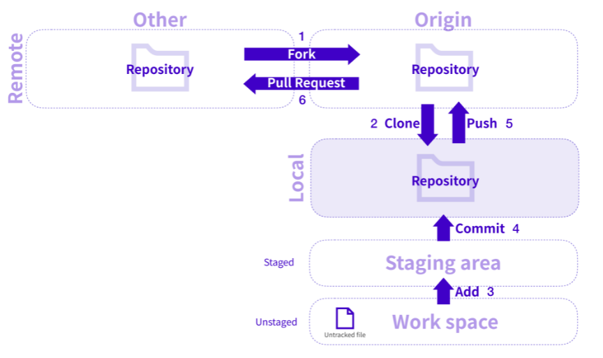

# Github

## 목차

[1. Github](#1-github)

[2. Github workflow](#2-github-workflow)
- [2.1. Fork](#21-fork)
- [2.2. Clone](#22-clone)
- [2.3. Add](#23-add)
- [2.4. Commit](#24-commit)
- [2.5. Push](#25-push)
- [2.6. Pull](#26-pull)
- [2.7. Pull Request](#27-pull-request)

## 1. Github

Github는 개발과 협업을 위한 코드 호스팅 플랫폼으로 Git Repository를 관리할 수 있는 클라우드 기반 서비스입니다.

Github를 사용하여 프로젝트와 버전을 관리하며, 코드를 공유하거나 다른 사용자들과 협업할 수 있습니다.

## 2. Github workflow

### 2.1. Fork

Fork는 다른 사람의 Remote Repository를 자신의 Remote Repository로 복제하는 과정을 의미합니다.

Fork한 프로젝트는 원본 프로젝트와는 별개로 관리됩니다.

### 2.2. Clone

Clone은 코드를 수정하거나 작업하기 위해서 Remote Repository를 Local Repository로 복제하는 과정을 의미합니다.

### 2.3. Add

Add는 현재 작업 디렉토리의 파일을 Git의 추적 대상으로 추가하는 과정을 의미합니다.

보통 작업 디렉토리에서 파일을 수정하거나 새 파일을 만들었을 때, 해당 파일을 깃의 추적 대상으로 추가해야 합니다.

Add를 하면 파일은 Git의 Staging area에 추가됩니다. 
Staging area에 있는 파일들은 Staged 된 파일이라고 하며, 이는 Commit 할 준비가 된 파일들을 의미합니다.

### 2.4. Commit

Commit은 현재 작업 디렉토리의 상태를 저장하는 것으로, 코드나 파일의 변경 사항을 저장하는 것을 말합니다. 
이를 특정 시점의 스냅샷(Snapshot)이라고 생각할 수 있습니다.

Commit을 하면 Git은 현재 상태의 스냅샷을 찍어서 저장합니다. 
이를 통해 이전 상태와의 차이를 추적하고, 필요한 경우 이전의 상태로 손쉽게 돌아갈 수 있습니다. 
또한 Commit은 프로젝트의 변경 이력을 기록하는 데에도 사용되어, 누가 언제 어떤 변경을 했는지 추적할 수 있습니다.

### 2.5. Push

Push는 로컬에서 작업한 변경 사항을 Remote Repository에 업로드하는 과정을 의미합니다.

로컬에서 Commit을 통해 변경 사항을 저장한 후, 이를 Remote Repository에 반영하기 위해 Push를 합니다.

### 2.6. Pull

Pull은 Remote Repository에서 변경 사항을 Local Repository로 가져오는 과정을 의미합니다.

Pull을 통해 Local Repository와 Remote Repository의 동기화를 유지하고 최신 변경 사항을 반영할 수 있습니다.

위 사진에서는 Pull이 나오지 않았지만, Clone 자리에 Pull이 오면 됩니다.

### 2.7. Pull Request

Pull Request는 변경 사항을 원본 프로젝트에 반영하기 위해 다른 개발자들에게 요청하는 과정을 의미합니다. 

자신이 수정한 내용을 원본 프로젝트에 반영하고 싶을 때, Pull Request를 생성하여 해당 변경 사항을 원본 프로젝트 관리자에게 보냅니다. 
관리자는 Pull Request를 검토하고, 승인할 경우 해당 변경 사항을 병합(merge)하여 프로젝트에 반영할 수 있습니다.

Pull Request는 줄여서 PR이라고 부르기도 합니다.