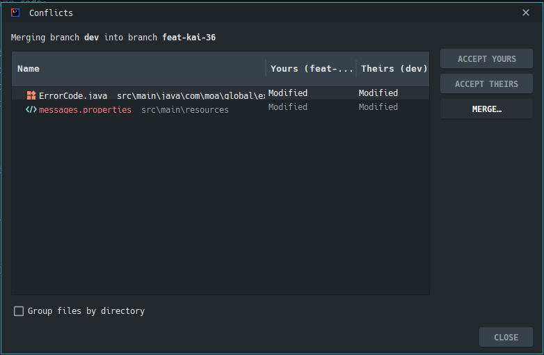
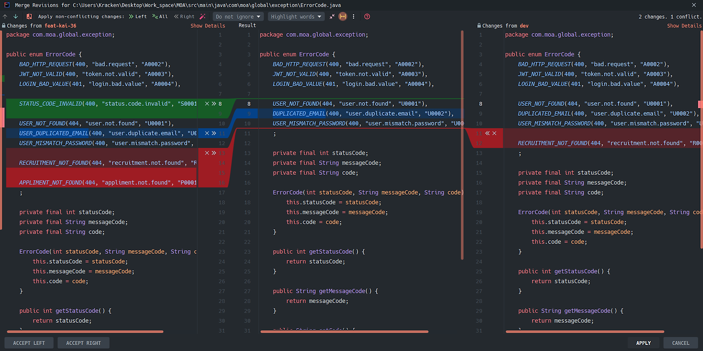
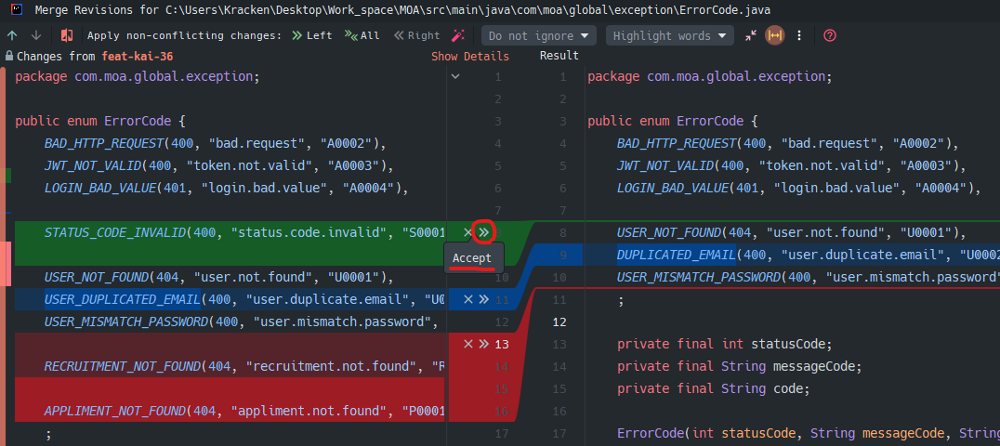

# Merge conflict

## 목차

[1. Merge conflict](#1-merge-conflict)

[2. Merge conflict 해결 방법](#2-merge-conflict-해결-방법)
- [2.1. 수동으로 충돌 해결하는 방법](#21-수동으로-충돌-해결하는-방법)
- [2.2. 에디터에서 제공되는 옵션으로 해결하는 방법](#22-에디터에서-제공되는-옵션으로-해결하는-방법)

## 1. Merge conflict

Merge conflict(병합 충돌)는 두 개의 다른 branch를 병합할 때 발생할 수 있는 문제로, 두 branch가 동일한 파일의 동일한 부분을 변경했을 때 발생합니다.<br>
Git은 이런 상황에서 자동으로 병합을 수행할 수 없으며, 사용자가 충돌을 해결하고 병합해 줘야 합니다.

일반적으로 Merge conflict가 발생하면 Git은 충돌이 발생한 파일을 자동으로 표시해 줍니다.<br>
충돌이 발생한 부분은 아래와 같이 표시됩니다.

```
<<<<<<< HEAD
현재 브랜치의 내용
=======
병합하려는 브랜치의 내용
>>>>>>> branch_name
```

"<<<<<<< HEAD"는 현재 작업 중인 branch의 변경 내용을 나타냅니다.<br>
">>>>>>> branch_name"은 병합하려는 branch의 변경 내용을 나타냅니다.<br>
"======="는 두 변경 내용 사이의 구분을 나타냅니다.

## 2. Merge conflict 해결 방법

Merge conflict 해결 방법으로는 수동으로 충돌 해결하는 방법, 에디터에서 제공되는 옵션으로 해결하는 방법 등이 있습니다.

코드 병합을 마치면 병합 커밋(merge commit)을 생성해 주기 위해서 파일을 Staging area로 다시 추가해 줍니다.

### 2.1. 수동으로 충돌 해결하는 방법

충돌이 발생한 파일을 열어서 충돌 부분을 직접 수정하는 방법으로, 충돌 부분은 "<<<<<<<", "=======", ">>>>>>>"와 같은 마커로 표시되어 있어, 이를 기반으로 어느 부분이 현재 branch의 변경 내용이고, 어느 부분이 병합 대상 branch의 변경 내용인지 파악하여, 수동으로 수정하는 방법입니다.

### 2.2. 에디터에서 제공되는 옵션으로 해결하는 방법

VScode, Intellij 에디터에서 제공되는 옵션으로 해결하는 방법입니다.

#### 2.2.1. VScode에서 제공되는 옵션으로 해결하는 방법

VScode에서 제공되는 옵션 중에는 Accept Current Change, Accept Incoming Change, Accept Both Changes와 같은 옵션이 있습니다.

> Accept Current Change 

Accept Current Change 옵션을 선택하면 현재 branch의 변경 내용을 수용합니다.<br>
즉, 현재 작업 중인 branch의 변경 내용을 충돌 해결 결과로 사용합니다.

> Accept Incoming Change

Accept Incoming Change 옵션을 선택하면 병합하려는 branch의 변경 내용을 수용합니다.<br>
즉, 병합하려는 branch의 변경 내용을 충돌 해결 결과로 사용합니다.

> Accept Both Changes

Accept Both Changes 옵션을 선택하면 충돌이 발생한 부분에 있는 모든 변경 내용을 모두 수용합니다.<br>
즉, 현재 branch와 병합하려는 branch의 모든 변경 내용을 충돌 해결 결과로 사용합니다.

#### 2.2.2. Intellij에서 제공되는 옵션으로 해결하는 방법

Intellij에서 제공되는 Git -> Resolve Conflicts에서 충돌이 일어난 파일들을 확인하고 충돌을 해결할 수 있습니다.



충돌이 일어난 파일을 클릭하고 ACCEPT YOURS, ACCEPT THEIRS 옵션을 선택하여 충돌을 해결하거나, 충돌이 일어난 파일을 더블 클릭하여 직접 충돌을 해결할 수 있습니다.

ACCEPT YOURS는 현재 branch의 변경 사항을 수용합니다.<br>
즉, 현재 작업 중인 branch에 있는 변경 사항을 충돌 해결 결과로 사용합니다.

ACCEPT THEIRS는 병합하려는 branch의 변경 사항을 수용합니다.<br>
즉, 병합하려는 branch에 있는 변경 사항을 충돌 해결 결과로 사용합니다.

충돌이 일어난 파일을 더블 클릭하여 직접 충돌을 해결하려고 하면 아래 사진과 같은 화면이 보입니다.



위 사진에서 왼쪽 화면과 오른쪽 화면은 병합하려고 하는 branch의 코드이며 가운데는 병합을 적용할 코드입니다.



">>" 아이콘을 클릭하게 되면 코드가 반영되고 "X" 아이콘을 누르면 해당 코드가 무시됩니다.<br>
이를 통해 코드를 선택적으로 병합할 수 있습니다.