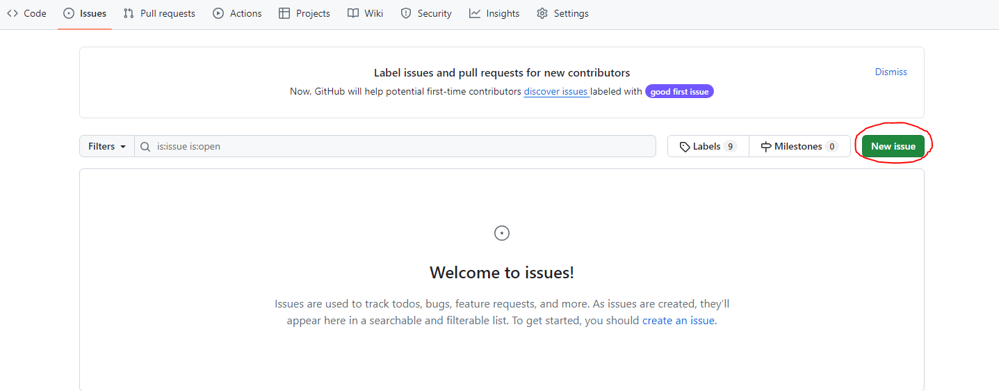
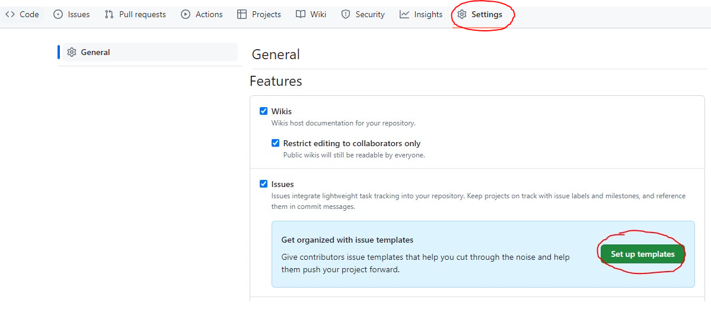
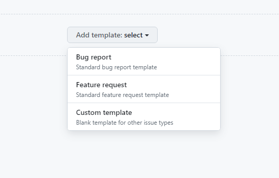
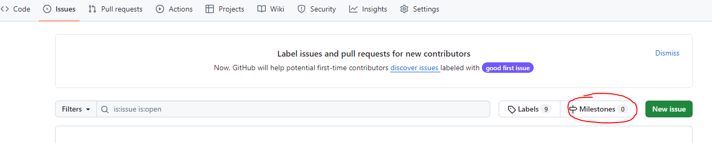
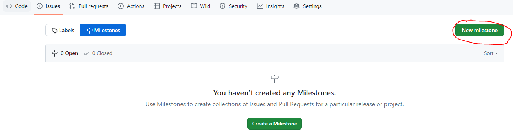
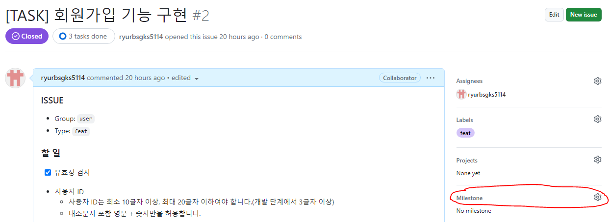
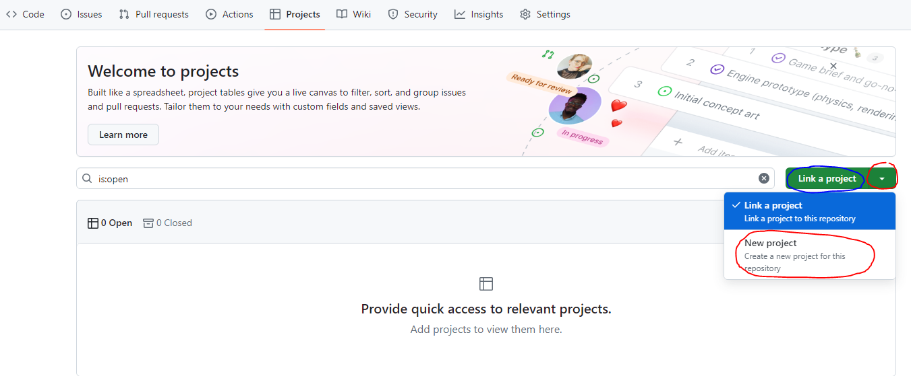

# Github Issues, Milestones, Projects

## 목차

[1. Issues](#1-issues)
- [1.1. Issue 생성](#11-issue-생성)
- [1.2. Issue template 생성](#12-issue-template-생성)
- [1.3. Issue template sample](#13-issue-template-sample)

[2. Milestones](#2-milestones)
- [2.1. Milestone 생성](#21-milestone-생성)
- [2.2. Milestone Issue 추가](#22-milestone-issue-추가)

[3. Projects](#3-projects)
- [3.1. Project 생성](#31-project-생성)

## 1. Issues

Issues(이슈)는 프로젝트에서 발생하는 모든 것을 추적하고 관리하는 데 사용됩니다.

Issues는 버그 보고서, 기능 요청, 작업 항목 등과 같이 다양한 형태일 수 있습니다.<br>
각 Issues는 제목, 설명, 담당자, 라벨 등의 속성을 가질 수 있습니다.

Issues를 통해 팀원들은 문제를 확인하고 해결하는 과정을 추적하고 의논할 수 있습니다.

### 1.1. Issue 생성

Issue를 생성하는 방법은 Issues 탭에서 New issue를 클릭하여 생성합니다.



### 1.2. Issue template 생성

반복적인 issue 생성을 간편하게 하기 위해 Issue template을 생성하여 사용할 수 있습니다.



template에는 Bug report, Feature request 2개의 기본 template이 있으며, 직접 커스텀하여 사용할 수 있는 Custom template이 존재합니다.



### 1.3. Issue template sample

```
### ISSUE
- Group:  `group_name`
- Type: `feat_or_update`

### 할 일
1. [ ] 로그인 기능 구현

### 소요 시간
### `3h`
```

## 2. Milestones

Milestones(마일스톤)은 프로젝트의 단계나 목표를 설정할 때 사용됩니다.<br>
보통 마감일을 설정하여 특정한 작업이나 기능 개발 등을 완료하는 것을 목표로 합니다.

Milestones은 Issues와 결합하여 해당 마일스톤에 관련된 작업을 추적하고 진척 상황을 확인할 수 있습니다.

### 2.1. Milestone 생성

Milestone을 생성하는 방법은 Issues 탭에서 Milestones 탭을 클릭합니다.



화면이 이동되면 New milestone 버튼을 클릭하여 새로운 Milestone을 생성합니다.



### 2.2. Milestone Issue 추가

Milestone에 Issue를 추가하는 방법은 Issue 카드에 들어가서 오른쪽 메뉴에 Milestone을 클릭하여 생성된 Milestone을 선택합니다.



## 3. Projects

Projects(프로젝트)는 이슈와 마일스톤을 조직화하고 시각화하는 데 사용됩니다.

각 프로젝트는 커스텀 컬럼(일반적으로 To do, In progress, Done 등)을 가지고 있으며, 이슈를 해당 컬럼에 할당하여 작업의 진행 상황을 추적할 수 있습니다.

### 3.1. Project 생성

Project를 생성하는 방법은 Projects 탭에서 Link a project를 클릭하거나 Link a project 옆의 화살표를 눌러 New project를 클릭합니다.



Project를 Table, Board, Roadmap 형태로 선택하여 관리할 수 있습니다.<br>
Table은 테이블 형식으로 작업을 관리하고, Board는 칸반 보드 형식으로, Roadmap은 일정 계획을 시각적으로 표현하는 데 유용합니다.

