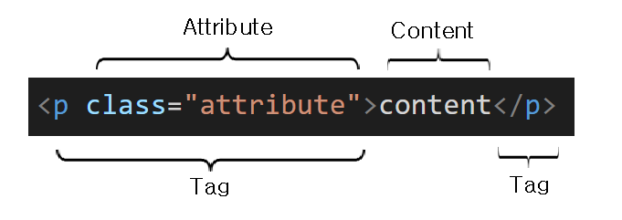

# HTML 기초

## 목차

[1. HTML](#1-html)

[2. Element(요소)](#2-element요소)

[3. Tag](#3-tag)
- [3.1. Head 영역의 Tag](#31-head-영역의-tag)
- [3.2. Body 영역의 Tag](#32-body-영역의-tag)
- [3.3. 시맨틱 태그(Semantic Tag)](#33-시맨틱-태그semantic-tag)

## 1. HTML

HTML은 HyperText Markup Language의 약자로 웹 페이지를 구성하는 마크업 언어이다.

HTML의 기본 구조는 크게 Head와 Body의 영역으로 구성된다.

각 영역에는 HTML Element(요소)가 존재한다.

## 2. Element(요소)

HTML은 Element(요소)로 구성되어 있으며 Element는 Tag와 Attribute(속성), Content로 구성되어 있다.



## 3. Tag

Tag는 부등호(<>)로 묶인 HTML 기본 구성 요소로 Start Tag(Opening Tag)와 End Tag(Closing Tag)로 구성되어 있다.

Start Tag에 다양한 Attribute가 들어갈 수 있으며 End Tag의 시작은 슬래쉬(/)를 넣어 해당 태그가 끝났음을 알린다.

### 3.1. Head 영역의 Tag

<br>

> head

head 태그는 기계가 식별할 수 있는 문서 정보(메타 데이터)를 담는다.

정보로는 문서가 사용할 title, script, style, link, meta, base 태그 등이 있다.

> title

title 태그는 브라우저의 제목 표시줄이나 페이지 탭에 보이는 문서 제목을 정의한다.

head 태그 안에는 하나의 title 태그만 존재해야 한다.

> script

script 태그는 데이터와 실행 가능한 코드를 문서에 포함할 때 사용하며 보통 JS코드와 함께 쓴다.

아래와 같이 src 속성으로 문서 내에 스크립트를 직접 삽입하는 것 대신 외부 스크립트를 가져올 수 있다.

```
<head>
  <script src='파일 경로'></script>
</head>
```

> style

style 태그는 문서나 문서 일부에 대한 스타일 정보를 포함한다.

style 태그는 문서의 head 태그 안에 위치해야 하지만 일반적으로 외부 시트에 작성하고 link 태그로 연결한다. (아래 link 태그 설명에 예시)

> link

link 태그는 현재 문서와 외부 리소스의 관계를 명시하는 태그로 주로 스타일 시트를 연결할 때 제일 많이 사용한다.

```
<head>
  <link href='style_file_path' rel='stylesheet' />
</head>
```

### 3.2. Body 영역의 Tag

<br>

> body

body 태그는 HTML 문서의 내용을 나타내며 한 문서에 하나의 body 태그만 존재할 수 있다.

> div & span

div 태그는 문서에서 특정 영역이나 구획을 정의할 때 사용하며 여러 요소들을 하나로 묶어 줄 수도 있다.

span 태그는 그 자체만으로는 어떠한 의미도 가지지 않지만 스타일을 적용하거나 HTML 문서에서 인라인 요소들을 하나로 묶을 때 사용한다.

div와 span 태그의 차이는 div는 블록 타입의 태그이고 span은 인라인 타입의 태그이다.

> h1 ~ h6

h1 ~ h6 태그는 HTML 문서에서 제목을 정의할 때 사용하며 숫자가 작을 수록 텍스트의 크기가 더 크며 제목을 더 강조한다.

> p

p 태그는 하나의 문단을 나타낸다.

> a

a 태그는 href 속성을 통해 다른 페이지나 같은 페이지의 특정 위치로 이동할 수 있는 하이퍼링크를 만든다.

> img

img 태그는 문서에 이미지를 삽입할 때 사용한다.

> form

form 태그는 정보를 제출하기 위한 구획을 나타낸다.

> button

button 태그는 클릭 가능한 버튼을 나타낸다.

button 태그는 type, value, form, disabled 과 같은 많은 속성이 있다.

> input

input 태그는 사용자로부터 입력을 받을 수 있는 입력 필드를 정의할 때 사용하며 End tag가 존재하지 않는다.

input 태그의 type 속성에서 자주 사용하는 속성값으로는 submit, text, number, password, checkbox, date, file 등이 있다.

> textarea

textarea 태그는 여러 줄의 텍스트를 입력할 수 있는 텍스트 입력 영역을 정의할 때 사용한다.

텍스트 입력 영역의 크기는 cols, rows 속성으로 지정할 수 있으며 CSS의 height, width 속성을 사용하면 더욱 손 쉽게 지정할 수 있다.

> ul

ul 태그는 순서가 없는 단순 목록을 표현할 때 사용한다.

> ol

ol 태그는 순서가 있는 목록을 표현할 때 사용한다.

> li

li 태그는 ul 또는 ol 태그 안에 들어가는 내용의 목록을 나타낼 때 사용한다.

li 태그의 부모 요소로는 반드시 ul 또는 ol 태그가 있어야 한다.

> table

table 태그는 행과 열로 이루어진 표를 나타낸다.

table 태그의 자식 태그로 tr, th, td 태그가 존재한다.

```
<table>
  <tr>
    <th>열의 제목</th>
    <td>테이블 셀의 데이터</td>
  </tr>
</table>
```

tr 태그는 테이블의 각 행을 정의한다.<br>
th 태그는 테이블의 각 열의 제목을 정의한다.<br>
td 태그는 하나의 테이블 셀을 정의한다.

### 3.3. 시맨틱 태그(Semantic Tag)

Semantic의 사전적 의미는 "의미론적인" 이라는 뜻으로 Semantic Tag를 직역하면 의미론적인 태그를 말한다.

HTML 작성시 div나 span 등 그 이름만 들어서는 그 내용이 무엇을 뜻하는지 한번에 알아보기가 힘든 경우가 있다.<br>
HTML5로 넘어오면서 이 문제를 해결하기 위해 각 Tag들이 무엇을 뜻하는지 명시적으로 표한하기 위해 Semantic Tag를 활용하기 시작했다.

Semantic Tag의 사용 장점은 nav, main 등과 같이 각 태그들이 무엇을 의미하는지 한눈에 알아보기 쉽도록 구현할 수 있다는 것이다.

> header

header 태그는 문서나 특정 섹션의 헤더를 정의할 때 사용한다.

> nav

nav 태그는 다른 페이지 또는 현재 페이지의 다른 부분과 연결되는 네비게이션 링크들의 집합을 묶어두기 위한 태그이다.

> section

section 태그는 문서에 포함된 독립적인 섹션을 정의할 때 사용한다.

> main

main 태그는 해당 문서의 주 컨텐츠를 정의할 때 사용한다.

> article

article 태그는 문서, 페이지, 애플리케이션 또는 사이트 안에서 독립적으로 구분해 배포하거나 재사용할 수 있는 구획을 나타낸다.

> aside

aside 태그는 페이지의 다른 컨텐츠들과 직접적인 관련이 없거나 약간의 연관성을 가지고 있지만 해당 컨테츠들로부터 분리시킬 수 있는 컨텐츠로 구성된 페이지 영역을 정의할 때 사용한다.

> footer

footer 태그는 문서나 특정 섹션의 하단부를 정의할 때 사용한다.

일반적으로 작성자, 저작권 정보, 관련 문서 등의 내용을 담는다.