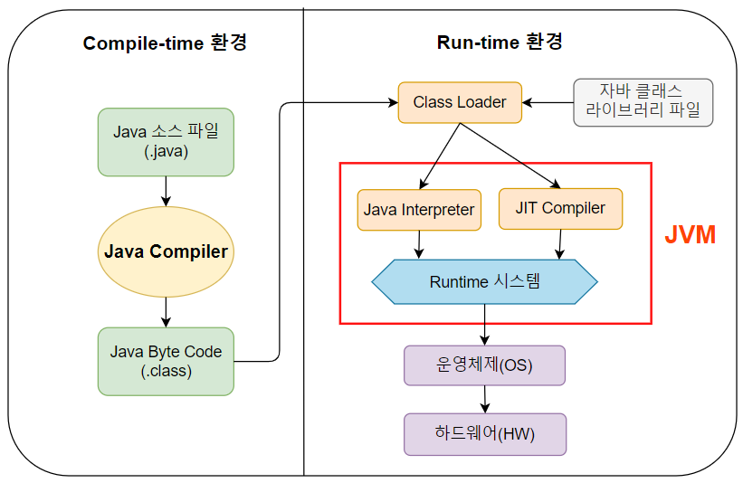
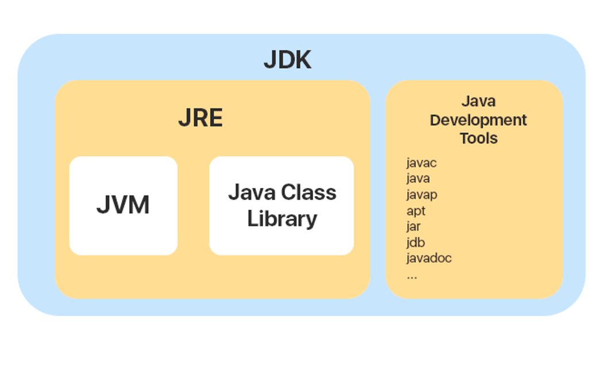

# JVM & JDK

## 목차

[1. JVM](#1-jvm)

[2. JVM 구성 요소](#2-jvm-구성-요소)
- [2.1. 바이트 코드](#21-바이트-코드)
- [2.2. 인터프리터](#22-인터프리터)
- [2.3. JIT 컴파일러](#23-jit-컴파일러)
- [2.4. 메모리 영역](#24-메모리-영역)
- [2.5. 클래스 로더](#25-클래스-로더)
- [2.6. 가비지 컬렉터](#26-가비지-컬렉터)

[3. JDK](#3-jdk)

## 1. JVM

JVM(Java Virtual Machine)은 자바 프로그램이 실행되는 가상 머신입니다.

JVM은 자바 언어로 작성된 프로그램을 컴파일을 통해 바이트 코드로 변환한 후 동일한 바이트 코드로 다른 운영체제나 하드웨어에서도 동일하게 실행할 수 있습니다. 
이로써 개발자는 특정 플랫폼에 종속되지 않고 자바 애플리케이션을 개발하고 배포할 수 있습니다.

## 2. JVM 구성 요소

JVM의 구성 요소로 바이트 코드(Bytecode), 인터프리터(Interpreter), JIT 컴파일러(Just-In-Time Compiler), 메모리 영역(Memory Area), 클래스 로더(Class Loader), 가비지 컬렉터(Garbage Collector)가 있습니다.

### 2.1. 바이트 코드

JVM에서 실행되는 자바 프로그램의 중간 형태로 자바 소스 코드가 컴파일되어 생성됩니다.

### 2.2. 인터프리터

바이트 코드를 한 줄씩 읽고 해석하여 해당 기계 코드를 실행하는 역할을 합니다.

### 2.3. JIT 컴파일러

실행 중에 바이트 코드를 네이티브 기계 코드로 변환하여 더 빠르게 실행되도록 하는 역할을 합니다.

### 2.4. 메모리 영역

JVM은 여러 가지 유형의 메모리 영역을 관리하며, 주요 영역에는 힙(Heap), 스택(Stack), 메서드 영역(Method Area), 네이티브 메모리 등이 있습니다.

### 2.5. 클래스 로더

JVM은 클래스를 동적으로 로드하는데 사용되는 클래스 로더를 가지고 있습니다. 
클래스 로더는 필요한 클래스를 로드하고 링크하는 역할을 합니다.

### 2.6. 가비지 컬렉터

더 이상 사용되지 않는 객체를 자동으로 식별하고 해제하여 메모리를 회수하는 역할을 합니다.

## 3. JDK

JDK(Java Development Kit)는 자바 프로그램을 개발하기 위한 도구와 환경을 제공하는 소프트웨어 개발 키트입니다.

JDK는 자바 프로그램을 개발하고 실행하는 데 필요한 모든 도구와 환경을 제공하므로 자바 개발자들이 프로젝트를 시작하고 관리하는 데 필수적인 요소입니다.

