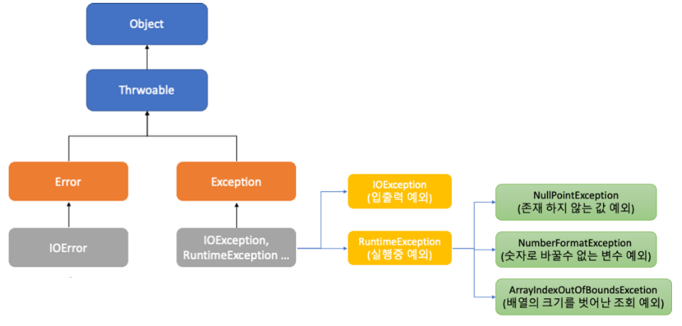

# 에러(Error)와 예외(Exception)

## 목차

[1. 에러(Error)](#1-에러error)

[2. 예외(Exception)](#2-예외exception)
- [2.1. Checked Exception(검사된 예외)](#21-checked-exception검사된-예외)
- [2.2. Unchecked Exception(검사되지 않은 예외)](#22-unchecked-exception검사되지-않은-예외)

[3. 예외 처리(Exception Handling)](#3-예외-처리exception-handling)
- [3.1. try-catch](#31-try-catch)
- [3.2. finally](#32-finally)
- [3.3. throw](#33-throw)
- [3.4. throws](#34-throws)

[4. 예외 클래스](#4-예외-클래스)
- [4.1. 예외 클래스 계층 구조](#41-예외-클래스-계층-구조)

## 1. 에러(Error)

에러(Error)는 시스템 레벨에서 프로그램에 심각한 문제를 일으켜 실행 중인 프로그램을 종료시킵니다.<br>
이러한 에러는 개발자가 미리 예측하여 처리할 수 없는 것이 대부분으로, 주로 자바 런타임 시스템에 의해 발생하며, 시스템 리소스 문제나 내부 오류로 인해 발생합니다.

## 2. 예외(Exception)

예외(Exception)는 실행 중인 프로그램을 비정상적으로 종료시킬 수 있는 문제를 나타내지만, 발생할 수 있는 상황을 미리 예측하여 프로그램 코드로 처리할 수 있는 문제입니다.<br>
따라서 개발자는 예외 처리(Exception Handling)를 통해 예외 상황을 처리할 수 있도록 코드의 흐름을 바꿀 필요가 있습니다.

예외는 크게 두 가지 유형으로 나뉩니다.

### 2.1. Checked Exception(검사된 예외)

Checked Exception은 컴파일 시점에서 확인하는 예외로, 프로그램의 정상적인 실행 흐름 중에 발생할 수 있는 예외 상황을 의미합니다.<br>
이러한 예외는 예측 가능하며, 반드시 처리해줘야 합니다.<br>
주로 외부 환경(파일 입출력, 네트워크 통신 등)과 관련된 예외입니다.

### 2.2. Unchecked Exception(검사되지 않은 예외)

Unchecked Exception은 런타임 시점에서 발생하는 예외로, 컴파일러가 예외 처리를 강제하지 않습니다.<br>
주로 프로그래밍 오류나 논리적 오류로 인해 발생합니다.

## 3. 예외 처리(Exception Handling)

Java에서 예외 처리(Exception Handling)는 프로그램 실행 중 발생할 수 있는 예외 상황을 적절히 처리하여 프로그램이 비정상적으로 종료되지 않도록 합니다.<br>
예외 처리는 try, catch, finally, throw, throws 키워드를 사용하여 구현합니다.

### 3.1. try-catch

try 코드 블록은 예외가 발생할 수 있는 코드를 포함하고, catch 코드 블록은 발생한 예외를 처리하는 코드를 포함합니다.

```
try {
  // 예외가 발생할 수 있는 코드
}  catch (예외_타입 e) {
  // 예외 처리 코드
}
```

하나의 try 코드 블록에 여러 개의 catch 코드 블록을 사용할 수도 있으며, 각 catch 코드 블록은 서로 다른 유형의 예외를 처리합니다.

```
try {
  // 예외가 발생할 수 있는 코드
}  catch (예외_타입1 e) {
  // 예외1 처리 코드
}  catch (예외_타입2 e) {
  // 예외2 처리 코드
}
```

### 3.2. finally

finally 코드 블록은 예외 발생 여부와 관계없이 항상 실행되는 코드를 포함합니다.

```
try {
  // 예외가 발생할 수 있는 코드
}  catch (예외_타입 e) {
  // 예외 처리 코드
}  finally {
  // 항상 실행되는 코드
}
```

### 3.3. throw

throw 키워드를 사용하여 명시적으로 예외를 발생시킬 수 있습니다.

```
throw new 예외_클래스("예외_메세지");
```

### 3.4. throws

메서드 선언부에 throws 키워드를 사용하여 해당 메서드에서 발생할 수 있는 예외를 명시할 수 있습니다.<br>
throws 키워드를 사용하면 메서드를 호출하는 쪽에서 예외를 처리하도록 합니다.

```
public 반환_타입 메서드명() throws 예외_클래스 {
  // 예외 발생 가능 코드
}
```

## 4. 예외 클래스

Java에서 예외(Exception) 클래스는 예외를 나타내기 위해 사용되는 클래스로, 자바의 표준 라이브러리에서 제공되며, 필요에 따라 사용자 정의 예외 클래스를 만들 수도 있습니다.

### 4.1. 예외 클래스 계층 구조

