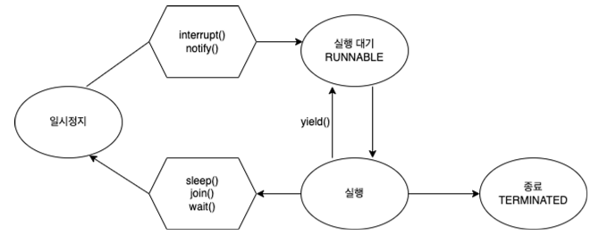

# 쓰레드(Thread)

## 목차

[1. 쓰레드(Thread)](#1-쓰레드thread)
- [1.1. 프로세스(Process)](#11-프로세스process)

[2. 쓰레드 생성 및 실행](#2-쓰레드-생성-및-실행)
- [2.1. Thread](#21-thread)
- [2.2. Runnable](#22-runnable)

[3. 멀티 쓰레드](#3-멀티-쓰레드)
- [3.1. 멀티 쓰레드의 장점](#31-멀티-쓰레드의-장점)
- [3.2. 멀티 쓰레드의 단점](#32-멀티-쓰레드의-단점)

[4. 사용자 쓰레드](#4-사용자-쓰레드)

[5. 데몬 쓰레드](#5-데몬-쓰레드)

[6. 쓰레드 우선순위](#6-쓰레드-우선순위)

[7. 쓰레드 그룹](#7-쓰레드-그룹)

[8. 쓰레드 상태](#8-쓰레드-상태)

[9. 쓰레드 제어](#9-쓰레드-제어)

## 1. 쓰레드(Thread)

Java에서 쓰레드(Thread)는 프로세스 내에서 독립적으로 실행되는 작업의 단위를 의미합니다.

하나의 프로세스는 여러 개의 쓰레드를 가질 수 있으며, 이들은 프로세스의 메모리를 공유합니다.

쓰레드를 사용하여 여러 작업을 동시에 수행할 수 있습니다.

### 1.1. 프로세스(Process)

프로세스는 실행 중인 프로그램을 의미합니다.

운영 체제는 다양한 프로그램을 동시에 실행하기 위해 프로세스를 관리하고 제어합니다.<br>
각 프로세스는 독립적인 메모리 공간을 가지고 있으며, 운영 체제에서 독립적으로 실행됩니다.

## 2. 쓰레드 생성 및 실행

Java에서 쓰레드를 생성하고 실행하는 방법은 크게 두 가지로 Thread 클래스를 상속받는 방법, Runnable 인터페이스를 구현하는 방법이 있습니다.

### 2.1. Thread

Thread 클래스를 상속받아 쓰레드를 생성할 수 있습니다.<br>
이 방법은 Thread 클래스의 run() 메서드를 오버라이딩하여 구현합니다.

```
class 클래스명 extends Thread {
  @Override
  public void run() {
    // 쓰레드 수행 작업
  }
}

클래스명 thread = new 클래스명(); // 쓰레드 생성
thread.start(); // 쓰레드 실행
```

### 2.2. Runnable

Runnable 인터페이스를 구현한 후, Thread 객체에 전달하여 쓰레드를 생성할 수 있습니다.<br>
이 방법은 다중 상속의 문제를 피할 수 있으며, Thread 클래스를 상속받는 것보다 더 유연합니다.

```
class 클래스명 implements Runnable {
  @Override
  public void run() {
    // 쓰레드 수행 작업
  }
}

클래스명 runnable = new 클래스명();
Thread thread = new Thread(runnable); // 쓰레드 생성
thread.start(); // 쓰레드 실행
```

## 3. 멀티 쓰레드

멀티 쓰레드는 프로세스 안에서 여러 개의 쓰레드가 실행되는 것을 말합니다.<br>
하나의 프로세스는 여러 개의 쓰레드를 가질 수 있으며, 이 쓰레드들은 프로세스의 자원을 공유합니다.

### 3.1. 멀티 쓰레드의 장점

- 성능 향상: 여러 개의 쓰레드가 동시에 작업을 수행하므로, CPU와 다른 리소스를 최대한 활용하여 작업을 병렬로 처리할 수 있습니다. 이는 프로그램의 실행 시간을 단축시키고, 응답성을 향상시킵니다.

- 응답성 향상: 멀티 쓰레드를 사용하면 한 작업이 블록 되어 있을 때도 다른 작업이 계속해서 진행될 수 있으므로, 전체적인 응답성이 향상됩니다.

- 자원 공유: 여러 쓰레드 간에 메모리 공간을 공유하여 데이터를 공유하고 효율적으로 처리할 수 있습니다. 이는 자원의 재사용을 촉진하고, 메모리 사용량을 줄여줍니다.

### 3.2. 멀티 쓰레드의 단점

- 경쟁 조건: 여러 쓰레드가 동시에 공유 자원에 접근할 때 발생할 수 있는 상태로, 쓰레드 간의 실행 순서에 따라 결과가 달라질 수 있습니다. 이를 방지하기 위해 동기화 메커니즘이 필요하며, 잘못된 구현은 예기치 못한 동작을 유발할 수 있습니다.

- 데드락: 두 개 이상의 쓰레드가 서로가 가진 자원을 점유한 채 대기하고 있는 상태로, 어떤 쓰레드도 작업을 진행할 수 없는 상황입니다. 이는 쓰레드의 관리가 복잡해지고, 시스템 전체의 성능을 저하시킬 수 있습니다.

- 자원 고갈: 쓰레드를 너무 많이 생성하면 시스템 자원(메모리, CPU 등)을 과도하게 사용할 수 있으며, 이는 성능 저하로 이어질 수 있습니다.

## 4. 사용자 쓰레드

보이는 곳(foreground)에서 실행되는 높은 우선순위를 가진 쓰레드를 말하며, 프로그램의 주요 작업을 담당합니다.

일반적으로 사용자 쓰레드는 프로그램이 실행되는 동안 계속 활성화되어 있습니다.<br>
사용자 쓰레드는 모든 사용자 작업이 완료될 때까지 JVM이 종료되지 않습니다.

## 5. 데몬 쓰레드

보이지 않는 곳(background)에서 실행되는 낮은 우선순위를 가진 쓰레드를 말하며, 사용자 쓰레드의 지원 역할을 합니다.

데몬 쓰레드는 모든 사용자 쓰레드가 종료되면 JVM에 의해 자동으로 종료됩니다.<br>
주기적인 루프, 자동 저장, 가비지 컬렉션 등에 사용될 수 있습니다.

## 6. 쓰레드 우선순위

쓰레드 우선순위는 쓰레드 스케줄러에 의해 결정되는 값으로, 쓰레드가 얼마나 CPU 시간을 할당받을지를 결정합니다.

쓰레드 우선순위는 1부터 10까지의 값을 가지며, 기본 우선순위는 5입니다.<br>
높은 숫자일수록 더 높은 우선순위를 나타냅니다.

### setPriority()

쓰레드의 우선순위를 설정하기 위해서 setPriority() 메서드를 사용합니다.

```
Thread thread = new Thread();
thread.setPriority(8);
```

### getPriority()

쓰레드의 우선순위를 조회하기 위해서 getPriority() 메서드를 사용합니다.

```
int threadPriority = thread.getPriority();
```

## 7. 쓰레드 그룹

쓰레드 그룹은 관련된 쓰레드들을 논리적으로 그룹화하는 방법을 제공합니다.<br>
이를 통해 쓰레드를 묶어서 관리할 수 있습니다.

모든 쓰레드들은 반드시 하나의 그룹에 포함되어 있어야 하며, 쓰레드 그룹은 계층적 구조를 가질 수 있습니다.<br>
최상위 그룹은 시스템 쓰레드 그룹이며, 메인 쓰레드는 시스템 쓰레드 그룹 하위에 있는 메인 쓰레드 그룹에 포함됩니다.<br>
쓰레드 그룹을 지정받지 못한 쓰레드는 자신을 생성한 부모 쓰레드의 그룹과 우선순위를 상속받게 되는데, 우리가 생성하는 쓰레드들은 메인 쓰레드 하위에 포함됩니다.

```
ThreadGroup group = new ThreadGroup("MyThreadGroup");
Thread thread1 = new Thread(ThreadGroup_group, Runnable_target, String_name);
```

## 8. 쓰레드 상태


### NEW(생성됨)

쓰레드 객체가 생성되었지만, 아직 start() 메서드가 호출되지 않은 상태입니다.

### RUNNABLE(실행 대기)

쓰레드가 실행되기 위해 대기 중인 상태입니다.<br>
실행 대기 큐에 있으며, 실행할 준비가 되었습니다.

### BLOCKED(차단됨)

쓰레드가 synchronized 블록이나 락을 얻지 못하고 차단된 상태입니다.<br>
다른 쓰레드가 해당 락을 확보할 때까지 기다립니다.

### WAITING(대기 중)

다른 쓰레드가 특정 조건을 충족할 때까지 기다리는 상태입니다.<br>
wait(), join() 등의 메서드 호출로 발생합니다.

### TIMED_WAITING(제한된 대기)

대기 시간이 지정된 상태입니다.<br>
sleep() 등의 메서드 호출로 발생합니다.

### TERMINATED(종료됨)

쓰레드의 실행이 종료된 상태입니다.<br>
쓰레드가 모든 작업을 완료하거나 예외가 발생하여 종료되었습니다.

## 9. 쓰레드 제어



### sleep()

현재 쓰레드를 지정된 시간 동안 멈추게 합니다.

### join()

정해진 시간 동안 지정한 쓰레드가 작업하는 것을 기다립니다.

### wait()

실행 중이던 쓰레드는 해당 객체의 대기실(waiting pool)에서 통지를 기다립니다.

### yield()

남은 시간을 다음 쓰레드에게 양보하고, 쓰레드 자신은 실행 대기 상태가 됩니다.

### interrupt()

일시 정지 상태인 쓰레드를 실행 대기 상태로 만듭니다.

### notify()

해당 객체의 대기실(waiting pool)에 있는 모든 쓰레드 중에서 임의의 쓰레드만 통지를 받습니다.