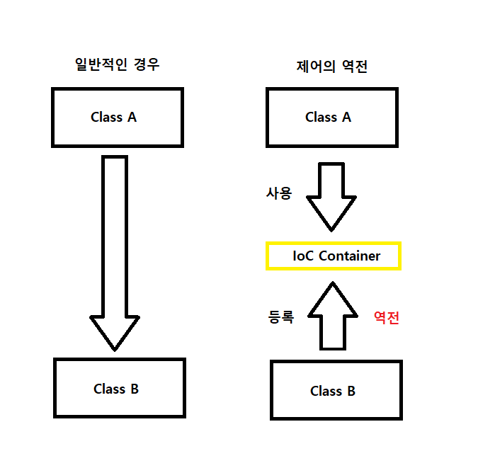

# IoC와 DI

## 목차

[1. IoC](#1-ioc)

[2. DI](#2-di)
- [2.1. 의존성(Dependency)](#21-의존성dependency)
- [2.2. 주입(Injection)](#22-주입injection)

[3. 제어의 역전](#3-제어의-역전)

## 1. IoC

IoC(Inversion of Control)는 제어의 역전을 의미합니다.<br>
전통적인 프로그래밍에서는 개발자가 직접 객체를 생성하고, 메서드를 호출하며 흐름을 제어합니다.<br>
그러나 IoC에서는 이러한 제어 흐름이 프레임워크에 의해 관리됩니다.<br>
이를 통해 애플리케이션의 결합도를 낮추고, 더 유연하고 테스트하기 쉬운 코드를 작성할 수 있습니다.

## 2. DI

DI(Dependency Injection)는 의존성 주입으로, IoC의 구체적인 구현 방식 중 하나입니다.<br>
DI는 객체가 자신의 의존성을 스스로 생성하지 않고, 외부에서 주입받는 방식을 의미합니다.<br>
Spring에서는 주로 DI를 통해 IoC를 구현합니다.

### 2.1. 의존성(Dependency)

의존성(Dependency)이란, 한 객체가 다른 객체에 의존하는 관계를 의미합니다.<br>
예를 들어 A 객체가 B 객체를 필요로 한다면, A는 B에 의존하고 있다고 할 수 있습니다.

### 2.2. 주입(Injection)

주입(Injection)이란, 의존성을 필요로 하는 객체에 외부에서 그 의존성을 제공하는 과정을 말합니다.

#### 2.2.1. 생성자 주입

생성자 주입은 생성자를 통해 의존성을 주입하는 방식으로, 가장 추천하는 주입 방식입니다.

```
@Service
public class UserService {
    private final UserRepository userRepository;

    public UserService(UserRepository userRepository) {
        this.userRepository = userRepository;
    }
}
```

#### 2.2.2. 세터 주입

세터 주입은 세터 메서드를 통해 의존성을 주입하는 방식입니다.

```
@Service
public class UserService {
    private UserRepository userRepository;

    @Autowired
    public void setUserRepository(UserRepository userRepository) {
        this.userRepository = userRepository;
    }
}
```

#### 2.2.3. 필드 주입

필드 주입은 필드에 직접 의존성을 주입하는 방식으로, 일반적으로 권장되지 않습니다.<br>
주로 테스트나 프레임워크가 객체를 생성할 때 유용하지만, 생성자 주입보다 테스트하기 어렵고 명시적이지 않습니다.

```
@Service
public class UserService {
    @Autowired
    private final UserRepository userRepository;
}
```

## 3. 제어의 역전

제어의 역전(Inversion of Control, IoC)이란, 객체 지향 프로그래밍에서의 설계 원칙 중 하나로, 객체의 생성과 생명주기 관리를 프레임워크에 위임합니다.

Spring에서는 IoC 컨테이너가 객체의 생성과 의존성 주입을 담당하며, 개발자는 필요한 객체를 IoC 컨테이너에 요청하여 사용합니다.

