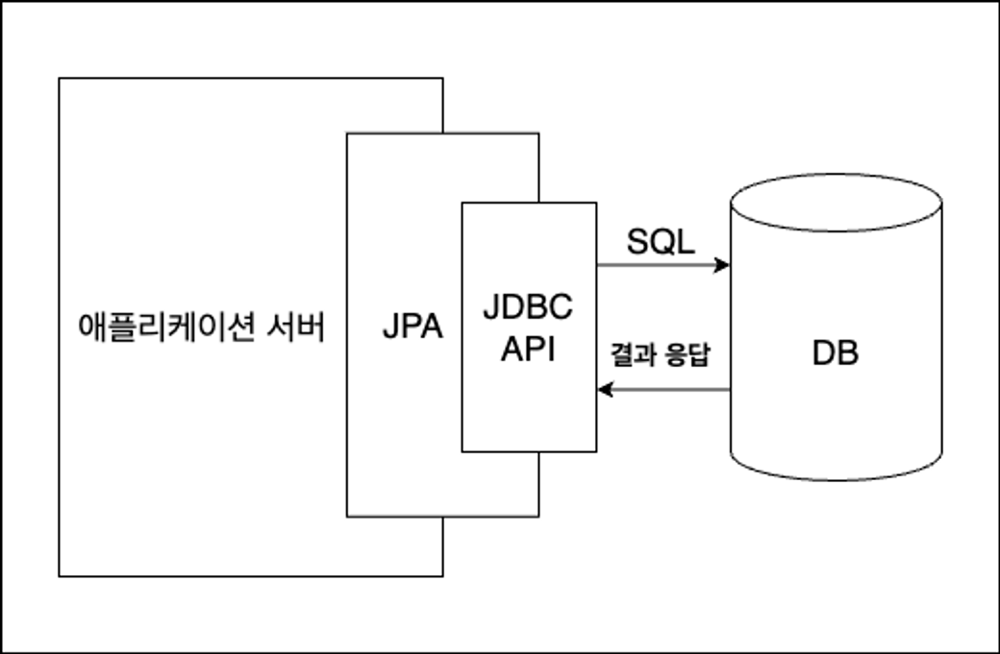

# JPA

## 목차

[1. ORM](#1-orm)

[2. JPA](#2-jpa)
- [2.1. JPA 주요 기능](#21-jpa-주요-기능)

[3. 하이버네이트(Hibernate)](#3-하이버네이트hibernate)

## 1. ORM

ORM(Object-Relational Mapping)은 객체 지향 프로그래밍 언어에서 정의된 객체와 관계형 데이터베이스의 데이터를 자동으로 매핑(mapping)하는 기술입니다.

객체 지향 언어의 클래스와 관계형 데이터베이스의 테이블 간의 변환을 자동화하여, 개발자는 데이터베이스와의 상호 작용을 객체 지향적인 방식으로 수행할 수 있습니다.

## 2. JPA

JPA(Java Persistence API)는 자바 애플리케이션에서 관계형 데이터베이스를 사용할 수 있도록 지원하는 자바 표준 ORM API입니다.

JPA는 애플리케이션과 JDBC 사이에서 동작합니다.

### 2.1. JPA 주요 기능

- CRUD 기능 제공

- 트랜잭션 관리

  JPA는 트랜잭션을 통해 데이터베이스 연산의 원자성을 보장합니다. 
  트랜잭션의 연산은 데이터베이스에 전부 반영이 되어야 하거나 전부 반영이 되지 않아야 합니다.

- 캐싱

  1차 캐시와 2차 캐시를 지원하여 성능을 향상시킵니다.

- JPQL(Java Persistence Query Language)

  객체 지향 쿼리 언어로, SQL과 유사하지만 Entity 객체를 대상으로 합니다.

## 3. 하이버네이트(Hibernate)

하이버네이트(Hibernate)는 JPA의 구현체 중 하나로, 가장 널리 사용되는 ORM 프레임워크입니다. 
Spring boot에서는 기본적으로 하이버네이트 구현체를 사용 중입니다.