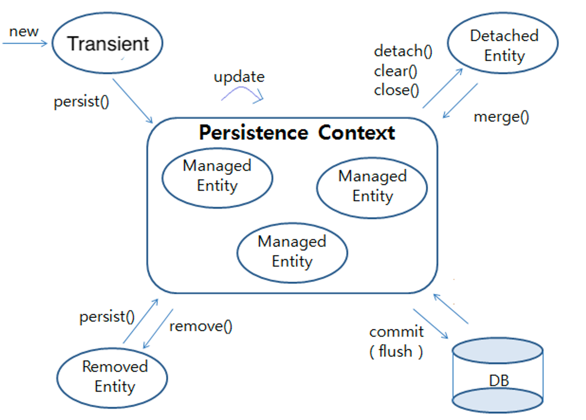

# 영속성 컨텍스트

## 목차

[1. 영속성 컨텍스트](#1-영속성-컨텍스트)
- [1.1. Entity 객체의 생명주기](#11-entity-객체의-생명주기)
- [1.2. 1차 캐시](#12-1차-캐시)
- [1.3. 변경 감지](#13-변경-감지)
- [1.4. 쓰기 지연 저장소](#14-쓰기-지연-저장소)

[2. EntityManager](#2-entitymanager)
- [2.1. 영속성 컨텍스트 생성 및 관리](#21-영속성-컨텍스트-생성-및-관리)
- [2.2. CRUD 작업 수행](#22-crud-작업-수행)
- [2.3. 쿼리 실행](#23-쿼리-실행)
- [2.4. 트랜잭션 관리](#24-트랜잭션-관리)

[3. EntityManagerFactory](#3-entitymanagerfactory)
- [3.1. EntityManager 생성](#31-entitymanager-생성)
- [3.2. 리소스 관리](#32-리소스-관리)
- [3.3. 애플리케이션 범위에서 공유](#33-애플리케이션-범위에서-공유)

## 1. 영속성 컨텍스트

영속성 컨텍스트(Persistence Context)는 JPA에서 Entity 객체를 저장, 조회, 수정, 삭제하는 작업을 관리하는 환경입니다.<br>
이는 Entity 객체와 데이터베이스 사이의 상태 변화를 추적하며, Entity 객체를 일관된 상태로 유지하는 역할을 합니다.

### 1.1. Entity 객체의 생명주기

영속성 컨텍스트는 Entity 객체의 생명주기를 관리합니다.<br>
Entity 객체는 비영속(Transient), 영속(Managed), 준영속(Detached), 삭제(Removed) 상태 중 하나를 가집니다.



### 비영속(Transient)

비영속 상태는 Entity 객체가 아직 영속성 컨텍스트에 의해 관리되지 않는 상태를 말합니다.

### 영속(Managed)

영속 상태는 Entity 객체가 영속성 컨텍스트에 의해 관리되고 있는 상태를 말합니다.

### 준영속(Detached)

준영속 상태는 Entity 객체가 한때 영속 상태였으나, 현재는 영속성 컨텍스트에 의해 더 이상 관리되지 않는 상태를 말합니다.

#### detach(entity)

특정 Entity를 준영속 상태로 전환합니다.

```
entityManager.detach(entity);
```

#### clear()

영속성 컨텍스트를 완전히 초기화하여 모든 Entity를 준영속 상태로 전환합니다.

```
entityManager.clear();
```

#### close()

영속성 컨텍스트를 종료합니다.<br>
이로 인해 모든 영속 상태의 Entity는 준영속 상태로 변경됩니다.

```
entityManager.close();
```

#### merge(entity)

준영속 상태의 Entity를 다시 영속 상태로 전환합니다.<br>
전달된 Entity를 사용하여 새로운 영속 상태의 Entity를 반환합니다.

```
Entity mergedEntity = entityManager.merge(entity);
```

### 삭제(Removed)

삭제 상태는 Entity 객체가 영속성 컨텍스트와 데이터베이스에서 삭제된 상태를 말합니다.

### 1.2. 1차 캐시

영속성 컨텍스트는 1차 캐시로 동작합니다.

1차 캐시는 영속성 컨텍스트 내부에 있는 메모리 공간으로, Entity 객체를 저장하고 관리하는 데 사용됩니다.<br>
Map 자료 구조로 되어 있어 키-값 쌍으로 Entity를 관리합니다.

### persist()

persist() 메서드를 통해 Entity를 영속성 컨텍스트에 저장하면, Entity는 1차 캐시에 저장됩니다.

### find()

find() 메서드를 통해 Entity를 조회할 때, 먼저 1차 캐시에서 해당 Entity를 찾습니다.<br>
1차 캐시에 존재하면 데이터베이스를 조회하지 않고 캐시된 Entity를 반환합니다.

### remove()

remove() 메서드를 통해 Entity를 삭제하면, 영속성 컨텍스트에서 해당 Entity가 제거됩니다.

### 1.3. 변경 감지

트랜잭션이 커밋되기 전에 영속성 컨텍스트는 Entity 객체의 변경 사항을 자동으로 감지하고, 필요한 경우 데이터베이스에 변경 사항을 반영합니다.

### 1.4. 쓰기 지연 저장소

쓰기 지연 저장소(ActionQueue)는 Entity의 변경 작업을 지연시켜 일괄 처리하는 메커니즘입니다.<br>
이를 통해 데이터베이스와의 통신을 최소화하고 성능을 향상시킵니다.

### flush()

flush() 메서드는 쓰기 지연 저장소에 있는 변경 사항을 데이터베이스에 반영합니다.<br>
트랜잭션이 커밋되기 전에 자동으로 호출되지만, 명시적으로 호출하여 즉시 데이터베이스에 반영할 수도 있습니다.

flush()는 영속성 컨텍스트 내의 모든 Entity의 변경 사항을 데이터베이스에 동기화합니다.<br>
이를 통해 일관된 상태를 유지하고 필요한 시점에 변경 사항을 적용할 수 있습니다.

## 2. EntityManager

EntityManager는 영속성 컨텍스트와 상호작용하는 인터페이스로, Entity 객체의 생명주기를 관리하고, 데이터베이스 작업을 수행합니다.


### 2.1. 영속성 컨텍스트 생성 및 관리

EntityManager는 영속성 컨텍스트를 생성하고 관리합니다.

### 2.2. CRUD 작업 수행

EntityManager는 Entity 객체의 저장, 조회, 수정, 삭제 작업을 수행합니다.

### 2.3. 쿼리 실행

EntityManager는 JPQL 쿼리 또는 SQL 쿼리를 사용하여 데이터베이스에서 데이터를 조회하거나 조작할 수 있습니다.

### 2.4. 트랜잭션 관리

트랜잭션을 시작, 커밋, 롤백하는 등의 트랜잭션 관리 기능을 제공합니다.<br>
일반적으로 JPA 구현체가 제공하는 트랜잭션 API를 통해 이루어집니다.

## 3. EntityManagerFactory

EntityManagerFactory는 EntityManager 인스턴스를 생성하는 팩토리 인터페이스입니다.

### 3.1. EntityManager 생성

EntityManagerFactory는 필요에 따라 새로운 EntityManager 인스턴스를 생성합니다.

### 3.2. 리소스 관리

EntityManagerFactory는 영속성 유닛의 설정 정보를 기반으로 생성되며, 다수의 EntityManager 인스턴스를 생성할 수 있습니다.<br>
이는 데이터베이스 연결 설정 및 기타 영속성 관련 리소스를 초기화하고 관리합니다.

### 3.3. 애플리케이션 범위에서 공유

일반적으로 EntityManagerFactory는 애플리케이션 범위에서 하나만 생성되어 공유됩니다.<br>
이는 비용이 많이 드는 리소스이기 때문에 애플리케이션이 시작될 때 한 번만 생성되고, 종료될 때까지 공유됩니다.