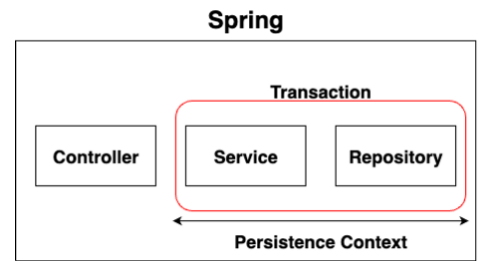
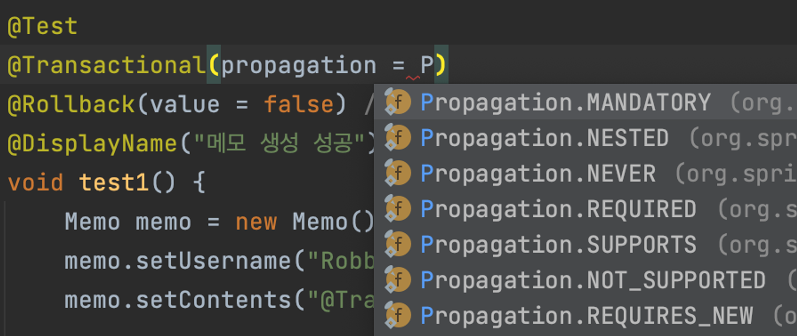

# SpringBoot JPA

## 목차

[1. SpringBoot JPA](#1-springboot-jpa)
- [1.1. Gradle 의존성 추가](#11-gradle-의존성-추가)
- [1.2. application.properties 설정](#12-applicationproperties-설정)
- [1.3. @PersistenceContext](#13-persistencecontext)

[2. Spring의 Transaction](#2-spring의-transaction)
- [2.1. @Transactional](#21-transactional)

[3. 영속성 컨텍스트와 Transaction의 생명주기](#3-영속성-컨텍스트와-transaction의-생명주기)

[4. Transaction 전파](#4-transaction-전파)

## 1. SpringBoot JPA

Spring Boot는 대부분의 설정을 자동으로 처리해주기 때문에, 기본적인 설정만으로 JPA를 매우 간편하게 사용할 수 있습니다.

### 1.1. Gradle 의존성 추가

```
implementation 'org.springframework.boot:spring-boot-starter-data-jpa'
```

### 1.2. application.properties 설정

```
spring.jpa.hibernate.ddl-auto=update
spring.jpa.properties.hibernate.show_sql=true
spring.jpa.properties.hibernate.format_sql=true
spring.jpa.properties.hibernate.use_sql_comments=true
```

### 1.3. @PersistenceContext

@PersistenceContext는 JPA의 EntityManager를 주입하는 데 사용됩니다.<br>
EntityManager는 JPA Entity의 CRUD 작업을 수행하는 데 사용됩니다.

```
@PersistenceContext
private EntityManager entityManager;
```

## 2. Spring의 Transaction

Spring은 Transaction을 선언적으로 관리할 수 있도록 지원합니다.<br>
Transaction은 데이터베이스 작업의 일관성과 무결성을 보장합니다.

### 2.1. @Transactional

Spring에서는 Transaction 관리를 위해 @Transactional 어노테이션을 제공합니다.<br>
메서드나 클래스에 @Transactional 어노테이션을 붙여서 해당 범위 내의 모든 데이터베이스 작업이 Transaction 안에서 수행되도록 합니다.

```
@Service
public class MyService() {
    private final MyRepositroy repositroy;

    public MyService(MyRepositroy repositroy) {
        this.repositroy = repositroy;
    }

    @Transactional
    public void transactionTest(MyEntity entity) {
        repositroy.save(entity);
    }
}
```

## 3. 영속성 컨텍스트와 Transaction의 생명주기

영속성 컨텍스트(Persistence Context)는 Entity의 상태를 관리하는 환경입니다.<br>
Entity Manager(엔티티 매니저)에 의해 관리되며, 특정 Transaction 범위 내에서 활성화됩니다.

Transaction이 시작되면 영속성 컨텍스트도 함께 시작되고, Transaction이 끝나면 영속성 컨텍스트도 종료됩니다.<br>
Transaction 안에서 변경된 Entity는 Transaction이 커밋될 때 데이터베이스에 반영됩니다.



## 4. Transaction 전파

Transaction 전파는 Transaction이 다른 Transaction에 어떻게 영향을 미칠지를 정의합니다.<br>
Spring에서는 다양한 전파 옵션을 제공합니다.

