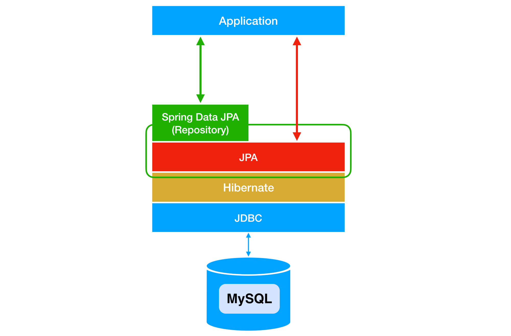

# Spring Data JPA

## 목차

[1. Spring Data JPA](#1-spring-data-jpa)

[2. SimpleJpaRepository](#2-simplejparepository)

[3. Spring Data JPA 사용방법](#3-spring-data-jpa-사용방법)
- [3.1. Gradle 의존성 추가](#31-gradle-의존성-추가)
- [3.2. Entity 클래스 정의](#32-entity-클래스-정의)
- [3.3. Repository 인터페이스 정의](#33-repository-인터페이스-정의)

## 1. Spring Data JPA

Spring Data JPA는 Spring Framework와 JPA를 결합하여 데이터 접근 계층을 쉽게 구현할 수 있도록 도와주는 모듈입니다.<br>
Spring Data JPA는 표준 JPA를 기반으로 하며, JPA의 기본적인 기능 외에도 다양한 편의 기능을 제공합니다.



Spring Data JPA는 다음과 같은 특징을 가집니다.

- 자동 Repository 생성: 인터페이스만 정의하면 자동으로 구현체를 생성합니다.

- 쿼리 메서드: 메서드 이름으로 쿼리를 생성할 수 있습니다.

- 페이징 및 정렬: 페이징 처리와 정렬 기능을 쉽게 구현할 수 있습니다.

- 비동기 쿼리: 비동기 방식으로 데이터를 조회할 수 있습니다.

## 2. SimpleJpaRepository

SimpleJpaRepository는 Spring Data JPA에서 기본적으로 제공하는 JPA Repository 구현체입니다.<br>
개발자가 정의한 Repository 인터페이스의 기본 구현을 제공합니다.

SimpleJpaRepository는 CRUD 또는 쿼리 메서드를 구현하거나 페이징 및 정렬 기능을 제공하는 역할을 합니다.

## 3. Spring Data JPA 사용방법

Spring Data JPA를 사용하기 위해서는 아래와 같은 단계를 거칩니다.

### 3.1. Gradle 의존성 추가

```
implementation 'org.springframework.boot:spring-boot-starter-data-jpa'
```

### 3.2. Entity 클래스 정의

```
@Entity
public class MyEntity {
    // entity 내용
}
```

### 3.3. Repository 인터페이스 정의

Repository 인터페이스를 정의하고, JPA Repository를 상속받습니다.<br>
이 인터페이스는 기본적인 CRUD와 쿼리 메서드를 제공합니다.

```
@Repository
public interface MyRepository extends JpaRepository<MyEntity, Long> {
}
```