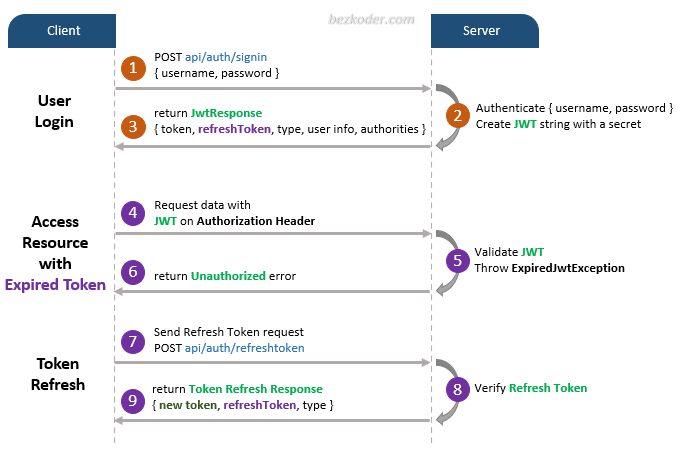

# JWT

## 목차

[1. 토큰](#1-토큰)

[2. JWT](#2-jwt)
- [2.1. Access Token](#21-access-token)
- [2.2. Refresh Token](#22-refresh-token)

[3. JWT 사용 이유](#3-jwt-사용-이유)

[4. JWT 구조](#4-jwt-구조)
- [4.1. Header](#41-header)
- [4.2. Payload](#42-payload)
- [4.3. Signature](#43-signature)

## 1. 토큰

토큰은 클라이언트에서 인증 정보를 보관하는 방법으로, 서버에서 사용자의 인증 정보를 암호화하거나 서명한 상태로 클라이언트에 넘겨줍니다.<br>
이를 통해 사용자는 매번 자격 증명을 다시 제출하지 않고도 서버에 요청할 수 있습니다.<br>
토큰은 다양한 방식으로 구현될 수 있으며, 그 중 하나가 JWT 입니다.

## 2. JWT

JWT(JSON Web Token)는 JSON 포맷으로 사용자에 대한 정보를 저장하는 웹 토큰입니다.<br>
JWT는 Access Token, Refresh Token 두 가지의 토큰 종류가 있습니다.

### 2.1. Access Token

Access Token은 비교적 짧은 기간 동안 유효하며, 자원에 대한 액세스를 허용하는데 사용됩니다.

### 2.2. Refresh Token

Refresh Token은 Access Token 보다 더 긴 기간 동안 유효하며, Access Token을 갱신하는 데 사용됩니다.



## 3. JWT 사용 이유

- 무결성: 서명으로 인해 토큰이 변조되지 않았음을 보장할 수 있습니다.

- 확장성: 토큰을 사용하는 시스템은 분산되어 있을 수 있으며, 토큰을 검증하는 데 중앙 서버가 필요하지 않습니다.

- 자기 포함적: 민감하지 않은 필요한 정보가 토큰 자체에 포함되어 있습니다.

## 4. JWT 구조

JWT는 점(.)으로 구분된 Header, Payload, Signature 세 부분으로 구성됩니다.

Payload, Signature 부분은 암호화 관련된 정보 양식이 들어있고, Payload에 실제 유저의 정보가 들어있습니다.

### 4.1. Header

Header는 토큰의 유형과 해싱 알고리즘이 포함된 JSON 객체입니다.

```
{
  "alg": "HS256",
  "typ": "JWT"
}
```

### 4.2. Payload

Payload는 Claim(클레임)이라고 불리는 정보가 포함된 JSON 객체입니다.<br>
Claim에는 사용자 정보 및 기타 데이터가 포함될 수 있습니다.

```
{
  "sub": "1234567890",
  "username": "ryu",
  "admin": true
}
```

### 4.3. Signature

Signature는 Header와 Payload를 인코딩한 후 비밀키를 사용하여 서명한 값입니다.<br>
이는 토큰의 무결성을 보장합니다.

```
HMACSHA256(
  base64UrlEncode(header) + "." + base64UrlEncode(payload),
  secret)
```