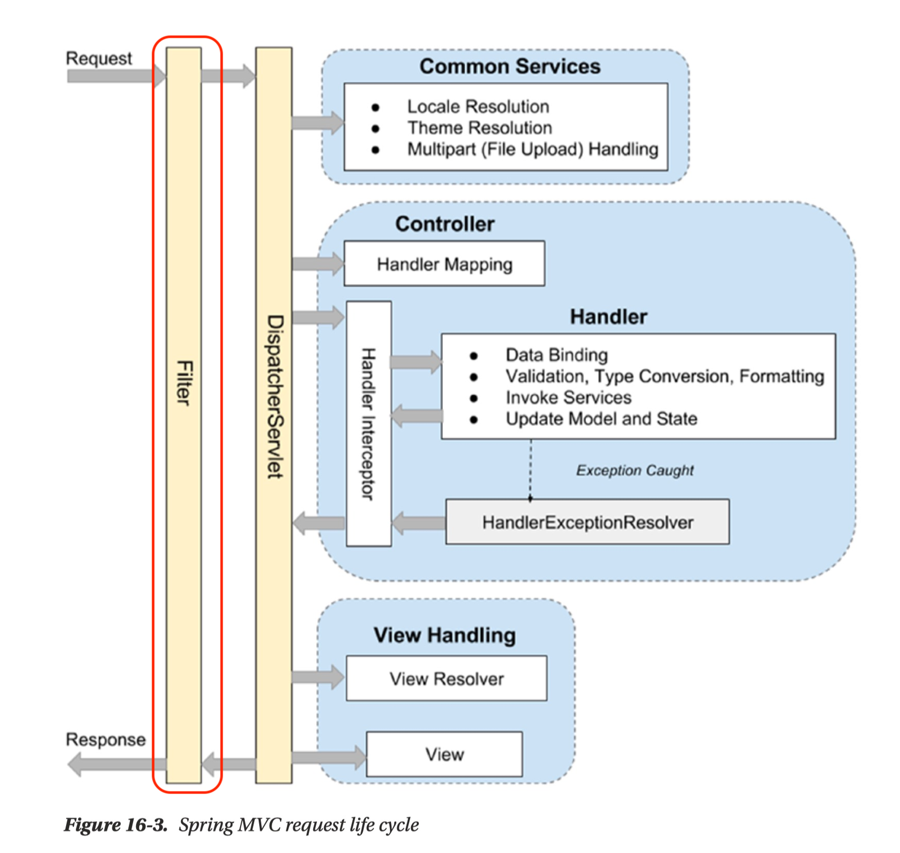
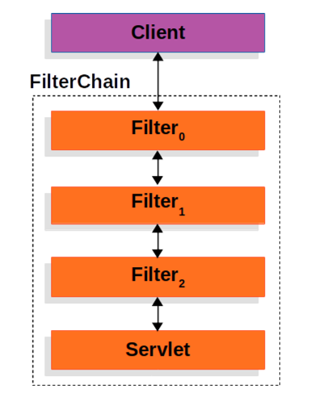

# Filter

## 목차

[1. Filter(필터)](#1-filter필터)

[2. Filter Chain(필터 체인)](#2-filter-chain필터-체인)
- [2.1. Filter Chain 특징](#21-filter-chain-특징)

[3. Filter 적용](#3-filter-적용)

## 1. Filter(필터)

Filter(필터)는 웹 애플리케이션에서 요청과 응답을 가로채고, 그 중간에서 특정 작업을 수행하는 역할을 합니다.



Filter는 주로 다음과 같은 용도로 사용됩니다.

- 요청 검증: 요청에 포함된 데이터의 유효성을 검사하고, 잘못된 요청을 차단하는 역할

- 인증 및 인가: 사용자의 인증 상태를 확인하고, 필요한 경우 권한을 검사하는 역할

- 로깅(logging): 요청과 응답에 대한 정보를 기록하는 역할

- 데이터 변환: 요청이나 응답 데이터를 변환하거나 포맷을 변경하는 역할

## 2. Filter Chain(필터 체인)

Filter Chain(필터 체인)은 여러 개의 Filter를 순차적으로 적용하는 구조를 말합니다.

Filter Chain은 Filter들을 체인처럼 연결하여 요청이 처음부터 끝까지 여러 Filter를 통과하도록 합니다.<br>
각각의 Filter는 다음 Filter로 요청을 전달하거나, 요청을 처리하고 응답을 생성할 수 있습니다.



### 2.1. Filter Chain 특징

- 순서 보장: Filter들은 정의된 순서대로 실행됩니다.

- 유연성: 각 Filter는 독립적으로 구현되며, 필요에 따라 필터를 추가하거나 제거할 수 있습니다.

- 재사용성: Filter는 다양한 URL 패턴에 대해 재사용될 수 있습니다.

## 3. Filter 적용

```
@Component
@Order(1)
public class MyFilter implements Filter {
    public void doFilter(ServletRequest request, ServletResponse response, FilterChain chain) throws IOException, ServletException {
        // 전 처리
        chain.doFilter(request, response); // 다음 Filter로 이동
        // 후 처리
    }
}
```

### @Order

@Order 어노테이션은 클래스 레벨에 적용되며, Filter의 순서를 지정하는 데 사용됩니다.<br>
숫자가 작을수록 우선순위가 높습니다.

### chain.doFilter()

chain.doFilter() 메서드는 Filter Chain에서 다음 Filter를 호출하는 역할을 합니다.<br>
Filter는 이 메서드를 호출함으로써 다음 Filter로 요청을 전달하고, Filter Chain이 끝나면 서블릿이나 최종 목적지에 요청이 도달합니다.

doFilter() 메서드 내에서 chain.doFilter() 메서드를 호출하기 전후에 요청이나 응답을 조작할 수 있습니다.

- 전 처리: chain.doFilter() 메서드 호출 전의 로직은 요청에 대해 수행됩니다.

- 후 처리: chain.doFilter() 메서드 호출 후의 로직은 응답에 대해 수행됩니다.