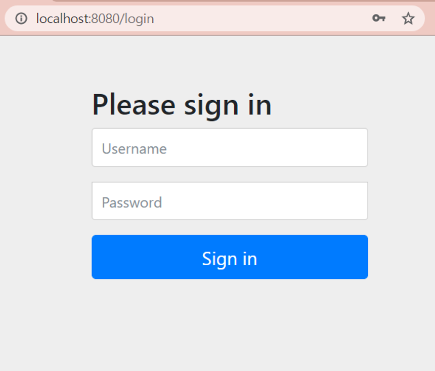
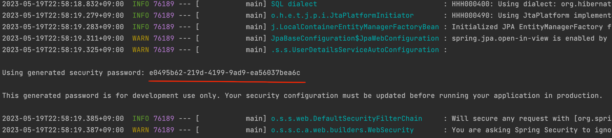
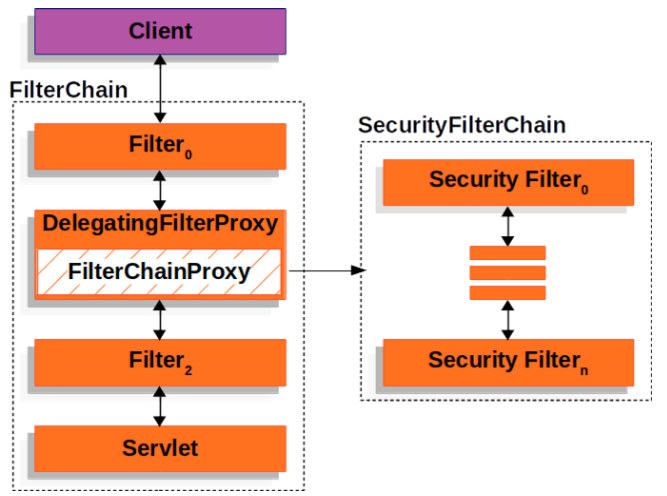
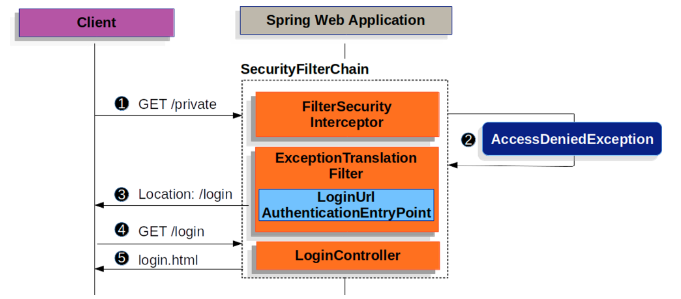
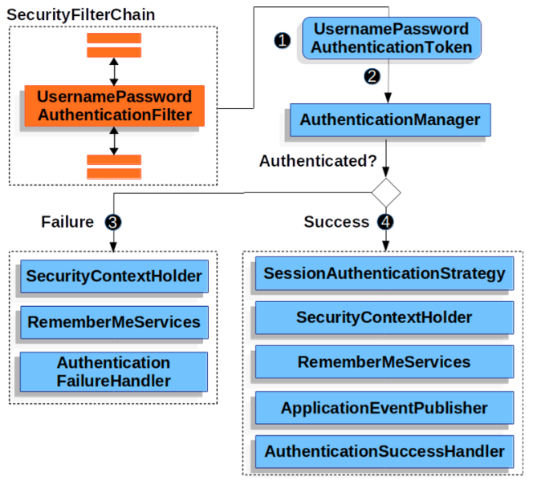
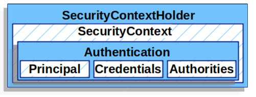
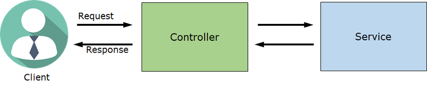
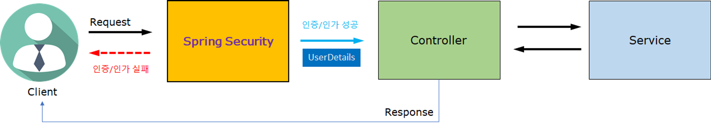
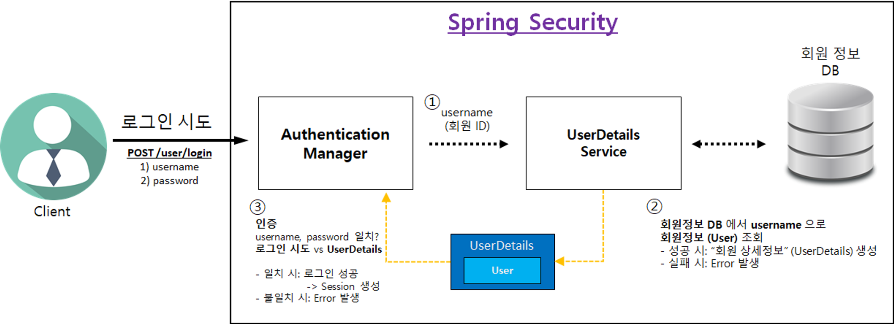

# Spring Security

## 목차

[1. Spring Security](#1-spring-security)

[2. Spring Security 의존성 추가](#2-spring-security-의존성-추가)

[3. Spring Security 설정](#3-spring-security-설정)

[4. Spring Security default 로그인 기능](#4-spring-security-default-로그인-기능)

[5. Spring Security - Filter Chain](#5-spring-security---filter-chain)

[6. Form Login 기반 인증](#6-form-login-기반-인증)

[7. UsernamePasswordAuthenticationFilter](#7-usernamepasswordauthenticationfilter)
- [7.1. SecurityContextHolder](#71-securitycontextholder)
- [7.2. Authentication](#72-authentication)
- [7.3. UserDetailsService](#73-userdetailsservice)
- [7.4. UserDetails](#74-userdetails)

[8. Spring Security 로그인 처리 과정](#8-spring-security-처리-과정)

[9. @AuthenticationPrincipal](#9-authenticationprincipal)

## 1. Spring Security

Spring Security는 Spring 애플리케이션에서 인증과 인가 기능을 제공하는 강력하고 확장 가능한 보안 프레임워크입니다.<br>
주요 기능으로는 사용자 인증 및 인가, 세션 관리, 암호화, 보안 이벤트 처리 등이 있습니다.

## 2. Spring Security 의존성 추가

```
implementation 'org.springframework.boot:spring-boot-starter-security'
```

## 3. Spring Security 설정

Spring Security를 활성화하려면, 설정 클래스에 @EnableWebSecurity 어노테이션을 추가해야 합니다.<br>
@EnableWebSecurity 어노테이션은 Spring Security 설정을 위한 기본 구성 요소를 제공합니다.

```
@Configuration
@EnableWebSecurity
public class SecurityConfig {
    @Bean
    public SecurityFilterChain securityFilterChain(HttpSecurity http) throws Exception {
        http.csrf((csrf) -> csrf.disable());
        http.authorizeHttpRequests( (authorizeHttpRequests) ->
                authorizeHttpRequests
                        .requestMatchers(PathRequest.toStaticResources().atCommonLocations()).permitAll()
                        .anyRequest().authenticated()
        );
        http.formLogin(Customizer.withDefaults());
        
        return http.build();
    }
}
```

## 4. Spring Security default 로그인 기능

Spring Security 설정에서 default 로그인 기능을 적용하거나 해제할 수 있습니다.

```
http.formLogin(Customizer.withDefaults());
```

위 코드를 선언하면 default 로그인 기능이 적용됩니다.<br>
default 로그인 기능이 적용되면 아래와 같은 로그인 창을 확인할 수 있으며, console 창에서 비밀번호를 확인할 수 있습니다.





formLogin() 메서드를 선언하지 않으면 default 로그인 기능이 해제됩니다.

## 5. Spring Security - Filter Chain

Filter Chain(필터 체인)은 여러 개의 Filter를 순차적으로 적용하는 구조를 말합니다.

Filter Chain은 Filter들을 체인처럼 연결하여 요청이 처음부터 끝까지 여러 Filter를 통과하도록 합니다.<br>
각각의 Filter는 다음 Filter로 요청을 전달하거나, 요청을 처리하고 응답을 생성할 수 있습니다.

Spring Security도 인증 및 인가를 처리하기 위해 Filter를 사용하는데, Spring Security는 FilterChainProxy를 통해서 상세 로직을 구현하고 있습니다.



## 6. Form Login 기반 인증

Form Login 기반 인증은 인증이 필요한 URL 요청이 들어왔을 때 인증이 되지 않았다면 로그인 페이지를 반환하는 형태입니다.



## 7. UsernamePasswordAuthenticationFilter

UsernamePasswordAuthenticationFilter는 Spring Security의 필터인 AbstractAuthenticationProcessingFilter를 상속한 Filter입니다.<br>
기본적으로 Form Login 기반을 사용할 때 username과 password를 확인하여 인증합니다.



1. 사용자가 username과 password를 제출하면 UsernamePasswordAuthenticationFilter는 인증된 사용자의 정보가 담기는 인증 객체인 UsernamePasswordAuthenticationToken을 만들어 AuthenticationManager에게 넘겨 인증을 시도합니다.

2. 실패하면 SecurityContextHolder를 비웁니다.

3. 성공하면 SecurityContextHolder에 Authentication를 세팅합니다.

### 7.1. SecurityContextHolder

SecurityContext는 인증이 완료된 사용자의 상세 정보(Authentication)를 저장합니다.<br>
SecurityContext는 SecurityContextHolder로 접근할 수 있습니다.



```
SecurityContext context = SecurityContextHolder.createEmptyContext();
Authentication authentication = new UsernamePasswordAuthenticationToken(principal, credentials, authorities);
context.setAuthentication(authentication);
SecurityContextHolder.setContext(context);
```

### 7.2. Authentication

Authentication은 현재 인증된 사용자를 나타내며 SecurityContext에서 가져올 수 있습니다.

- principal: 사용자를 식별하며, Username/Password 방식으로 인증할 때 일반적으로 UserDetails 인스턴스입니다.

- credentials: 주로 비밀번호로, 대부분 사용자 인증에 사용한 후 비웁니다.

- authorities: 사용자에게 부여한 권한을 GrantedAuthority로 추상화하여 사용합니다.

### 7.3. UserDetailsService

UserDetailsService는 Username/Password 인증방식을 사용할 때 사용자를 조회하고 검증한 후 UserDetails를 반환합니다.<br>
Custom하여 Bean으로 등록 후 사용 가능합니다.

### 7.4. UserDetails

검증된 UserDetails는 UsernamePasswordAuthenticationToken 타입의 Authentication을 만들 때 사용되며 해당 인증객체는 SecurityContextHolder에 세팅됩니다.<br>
Custom하여 사용 가능합니다.

## 8. Spring Security 처리 과정

Spring Security 사용 전과 후의 처리 과정 차이는 아래 사진과 같고, 로그인 처리 과정은 맨 아래 사진과 같습니다.

### Spring Security 사용 전



### Spring Security 사용 후



### Spring Security 로그인 처리 과정



## 9. @AuthenticationPrincipal

@AuthenticationPrincipal 어노테이션을 사용하면, Authentication의 Principal에 저장된 UserDetailsImpl을 가져올 수 있습니다.

```
@GetMapping("/profile")
public ResponseEntity<CommonResponse<User>> getProfile(@AuthenticationPrincipal UserDetailsImpl userDetails) {
    // 코드 내용
}
```