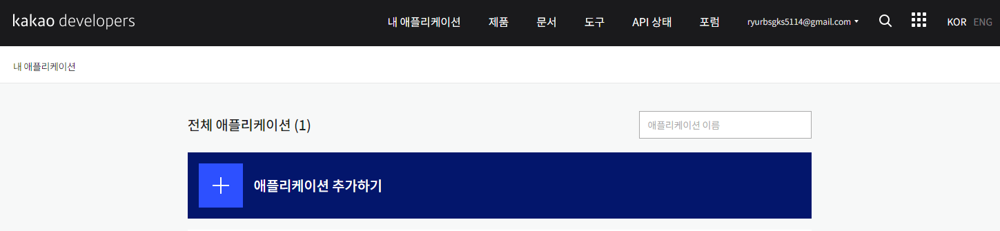

# 카카오 로그인 사용 승인

## 목차

[1. 카카오 로그인 사용 승인](#1-카카오-로그인-사용-승인)

## 1. 카카오 로그인 사용 승인

카카오 로그인을 사용하기 위해서는 카카오 개발 사이트에서 애플리케이션 등록이 필요합니다.

### 카카오디벨로퍼스 사이트

```
https://developers.kakao.com/console/app
```

### 애플리케이션 추가하기




### 사이트 도메인 등록하기


### Redirect URI(callback) 설정하기 


### 동의항목 설정하기


### 이메일 선택 동의 활성화


