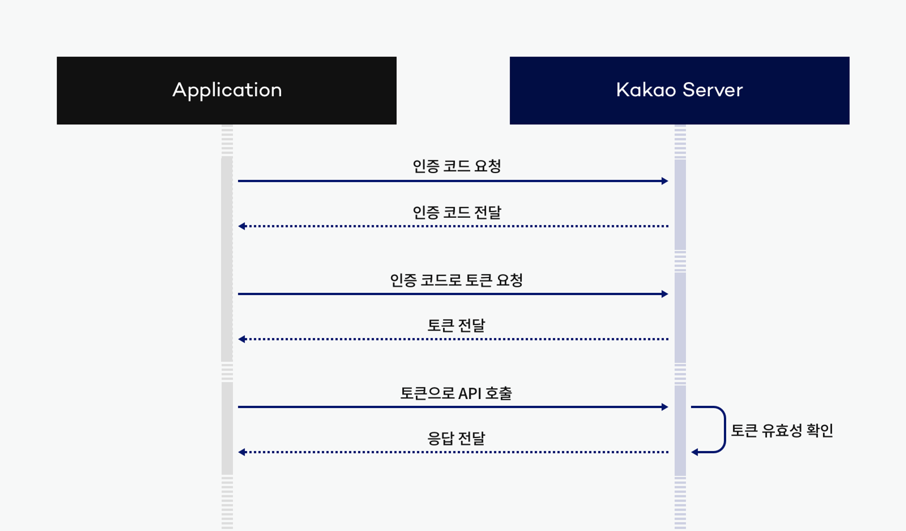

# 카카오 로그인

## 목차

[1. 카카오 로그인 Flow](#1-카카오-로그인-flow)

[2. DTO](#2-dto)

[3. RestTemplate](#3-resttemplate)

[4. Controller](#4-controller)

[5. Service](#5-service)

## 1. 카카오 로그인 Flow



## 2. DTO

```
@Getter
public class KakaoUserDto {
    private Long id;
    private String nickname;
    private String email;

    public KakaoUserDto(Long id, String nickname, String email) {
        this.id = id;
        this.nickname = nickname;
        this.email = email;
    }
}
```

## 3. RestTemplate

```
@Configuration
public class RestTemplateConfig  {
    @Bean
    public RestTemplate restTemplate(RestTemplateBuilder restTemplateBuilder) {
        return restTemplateBuilder
                .setConnectTimeout(Duration.ofSeconds(5))
                .setReadTimeout(Duration.ofSeconds(5))
                .build();
    }
}
```

## 4. Controller

```
@RestController
public class OAuthController {
    @Value("${kakao.rest.api.key}")
    private String CLIENT_ID;
    private static final String KAKAO_AUTH_URL = "https://kauth.kakao.com/oauth/authorize";
    private static final String REDIRECT_URI = "http://localhost:8080/api/user/kakao/callback";

    private final OAuthService oAuthService;

    public OAuthController(OAuthService oAuthService) {
        this.oAuthService = oAuthService;
    }

    @GetMapping("/api/users/login/kakao")
    public void redirectKakaoLogin(HttpServletResponse response) throws IOException {

        String redirectURL = KAKAO_AUTH_URL + "?client_id=" + CLIENT_ID + "&redirect_uri=" + REDIRECT_URI + "&response_type=code";
        response.sendRedirect(redirectURL);

    }

    @GetMapping("/api/user/kakao/callback")
    public ResponseEntity<MessageResponse> kakaoLogin(@RequestParam String code) throws JsonProcessingException {

        HttpHeaders headers = oAuthService.kakaoLogin(code, CLIENT_ID);
        MessageResponse response = new MessageResponse(200, "카카오 로그인에 성공했습니다.");

        return ResponseEntity.status(HttpStatus.OK).headers(headers).body(response);
    }
}
```

## 5. Service

```
@Service
public class OAuthService {

    private final PasswordEncoder passwordEncoder;
    private final UserRepository userRepository;
    private final RestTemplate restTemplate;
    private final JwtProvider jwtProvider;

    public OAuthService(PasswordEncoder passwordEncoder, UserRepository userRepository, RestTemplate restTemplate, JwtProvider jwtProvider) {
        this.passwordEncoder = passwordEncoder;
        this.userRepository = userRepository;
        this.restTemplate = restTemplate;
        this.jwtProvider = jwtProvider;
    }

    @Transactional
    public HttpHeaders kakaoLogin(String code, String CLIENT_ID) throws JsonProcessingException {

        String token = getToken(code, CLIENT_ID);

        KakaoUserDto kakaoUserDto = getKakaoUserInfo(token);

        User kakaoUser = registerKakaoUserIfNeeded(kakaoUserDto);

        String accessToken = jwtProvider.createAccessToken(kakaoUser.getUserId(), kakaoUser.getRole().getRole());
        String refreshToken = jwtProvider.createRefreshToken(kakaoUser.getUserId(), kakaoUser.getRole().getRole());
        ResponseCookie responseCookie = jwtProvider.createCookieRefreshToken(refreshToken);

        HttpHeaders headers = new HttpHeaders();
        headers.set("Authorization", "Bearer " + accessToken);
        headers.add(HttpHeaders.SET_COOKIE, responseCookie.toString());

        kakaoUser.updateRefreshToken(refreshToken);
        userRepository.save(kakaoUser);

        return headers;
    }

    private String getToken(String code, String CLIENT_ID) throws JsonProcessingException {

        URI uri = UriComponentsBuilder
                .fromUriString("https://kauth.kakao.com")
                .path("/oauth/token")
                .encode()
                .build()
                .toUri();

        HttpHeaders headers = new HttpHeaders();
        headers.add("Content-type", "application/x-www-form-urlencoded;charset=utf-8");

        MultiValueMap<String, String> body = new LinkedMultiValueMap<>();
        body.add("grant_type", "authorization_code");
        body.add("client_id", CLIENT_ID);
        body.add("redirect_uri", "http://localhost:8080/api/user/kakao/callback");
        body.add("code", code);

        RequestEntity<MultiValueMap<String, String>> requestEntity = RequestEntity
                .post(uri)
                .headers(headers)
                .body(body);

        ResponseEntity<String> response = restTemplate.exchange(requestEntity, String.class);

        JsonNode jsonNode = new ObjectMapper().readTree(response.getBody());

        return jsonNode.get("access_token").asText();
    }

    private KakaoUserDto getKakaoUserInfo(String accessToken) throws JsonProcessingException {

        URI uri = UriComponentsBuilder
                .fromUriString("https://kapi.kakao.com")
                .path("/v2/user/me")
                .encode()
                .build()
                .toUri();

        HttpHeaders headers = new HttpHeaders();
        headers.add("Authorization", "Bearer " + accessToken);
        headers.add("Content-type", "application/x-www-form-urlencoded;charset=utf-8");

        RequestEntity<MultiValueMap<String, String>> requestEntity = RequestEntity
                .post(uri)
                .headers(headers)
                .body(new LinkedMultiValueMap<>());

        ResponseEntity<String> response = restTemplate.exchange(requestEntity, String.class);

        JsonNode jsonNode = new ObjectMapper().readTree(response.getBody());
        Long id = jsonNode.get("id").asLong();
        String nickname = jsonNode.get("properties").get("nickname").asText();
        String email = jsonNode.get("kakao_account").get("email").asText();

        return new KakaoUserDto(id, nickname, email);
    }

    private User registerKakaoUserIfNeeded(KakaoUserDto kakaoUserDto) {

        User kakaoUser = userRepository.findByKakaoId(kakaoUserDto.getId()).orElse(null);

        if (kakaoUser == null) {

            String password = UUID.randomUUID().toString();
            String encodedPassword = passwordEncoder.encode(password);
            kakaoUser = new User(kakaoUserDto, encodedPassword, UserRole.USER, UserStatus.NORMAL, UserOauth.KAKAO);

        }

        return kakaoUser;
    }

}
```