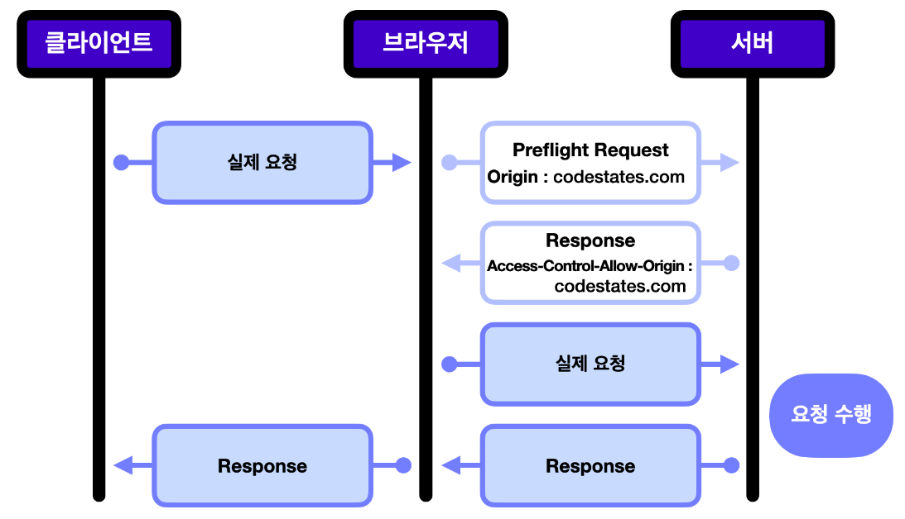

# CORS

## 목차

[1. CORS](#1-cors)

[2. CORS 작동 방식](#2-cors-작동-방식)
- [2.1. 프리플라이트 요청(Preflight Request)](#21-프리플라이트-요청preflight-request)
- [2.2. 실제 요청(Simple Request)](#22-실제-요청simple-request)

[3. CORS 주요 헤더](#3-cors-주요-헤더)

## 1. CORS

CORS(Cross-Origin Resource Sharing)는 웹 브라우저에서 실행되는 웹 애플리케이션이 다른 도메인에서 자원을 요청할 수 있도록 하는 보안 기능입니다. 
기본적으로 웹 브라우저는 동일 출처 정책(Same-Origin Policy)을 따르기 때문에, 다른 출처의 자원에 접근하는 것을 제한합니다. 
CORS는 이러한 제한을 완화하여 특정 조건 하에 다른 출처의 자원에 접근할 수 있도록 합니다.

## 2. CORS 작동 방식

### 2.1. 프리플라이트 요청(Preflight Request)

- 특정 요청(PUT, DELETE 또는 사용자 정의 헤더가 있는 요청)을 보내기 전에 브라우저는 OPTIONS 메서드를 사용하여 서버에 사전 요청을 보냅니다.

- 이 요청에는 실제 요청에 사용할 HTTP 메서드와 헤더가 포함되어 있습니다.

- 서버는 이 사전 요청에 응답하여 실제 요청을 허용할지 여부를 결정합니다.

### 2.2. 실제 요청(Simple Request)

- 프리플라이트 요청이 필요 없는 경우, 브라우저는 바로 실제 요청을 보냅니다.

- 서버는 응답에 CORS 헤더를 포함시켜 브라우저가 응답을 허용할지 결정하게 합니다.

## 3. CORS 주요 헤더

- Access-Control-Allow-Origin: 요청을 허용할 도메인을 지정합니다. 와일드카드(*)를 사용하여 모든 도메인을 허용할 수도 있습니다.

- Access-Control-Allow-Methods: GET, POST, PUT, DELETE 등과 같은 허용할 HTTP 메서드를 지정합니다.

- Access-Control-Allow-Headers: 요청 시 사용할 수 있는 헤더를 지정합니다.

- Access-Control-Allow-Credentials: 자격 증명(쿠키, HTTP 인증 등)을 사용할지 여부를 지정합니다.

- Access-Control-Expose-Headers: 응답에서 사용할 수 있는 헤더를 지정합니다.

- Access-Control-Max-Age: 프리플라이트 요청의 결과를 캐시할 시간(초)을 지정합니다.