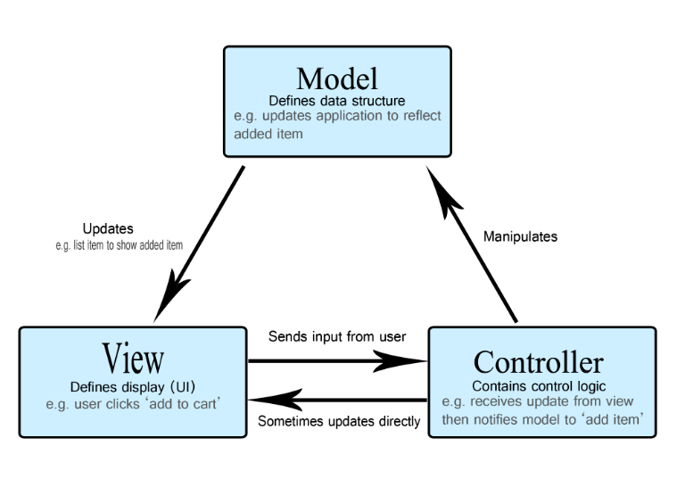
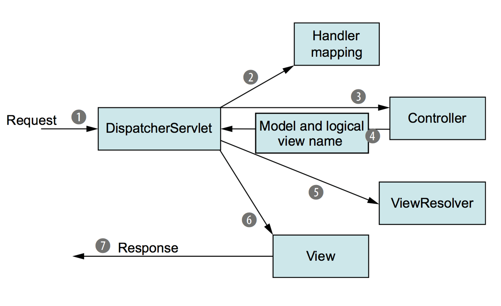

# Spring MVC

## 목차

[1. MVC](#1-mvc)
- [1.1. Model](#11-model)
- [1.2. View](#12-view)
- [1.3. Controller](#13-controller)

[2. Spring MVC](#2-spring-mvc)
- [2.1. Spring MVC 구성요소](#21-spring-mvc-구성요소)
- [2.2. Spring MVC 주요 특징](#22-spring-mvc-주요-특징)

[3. Front Controller](#3-front-controller)

## 1. MVC

MVC(Model-View-Controller) 패턴은 소프트웨어 디자인 패턴 중 하나로, 소프트웨어를 Model, View, Controller로 분리하여 개발하는 방법입니다.

### 1.1. Model

데이터와 비즈니스 로직을 담당하며, 데이터의 상태를 나타내고, 데이터의 변경에 따른 로직을 수행합니다.

### 1.2. View

사용자 인터페이스를 담당하며, 모델의 데이터를 시각적으로 표현하고, 사용자의 입력을 받아 Controller에 전달합니다.

### 1.3. Controller

사용자 입력을 처리하고, Model과 View 사이의 상호작용을 관리합니다. 
사용자의 요청에 따라 적절한 Model을 호출하고, 그 결과를 적절한 View에 전달합니다.

## 2. Spring MVC

Spring MVC는 Java 기반의 웹 애플리케이션을 개발하기 위한 프레임워크 중 하나로, MVC 패턴을 기반으로 합니다.

### 2.1. Spring MVC 구성요소

Spring MVC도 MVC 디자인 패턴과 마찬가지로, Model, View, Controller로 구성됩니다.

### Model

애플리케이션의 비지니스 로직과 데이터를 나타냅니다. 
이는 데이터베이스로부터 데이터를 가져오거나, 계산, 가공 등을 수행하는데 사용됩니다.

### View

사용자에게 정보를 보여주는 부분입니다. 
일반적으로 HTML, JSP, Thymeleaf 등의 템플릿 엔진을 사용하여 사용자 인터페이스를 생성하고, 클라이언트에게 보여줍니다.

### Controller

사용자의 요청을 받고, 이를 처리하는 부분입니다. 
클라이언트로부터 요청이 오면, 해당 요청을 받아서 적절한 비즈니스 로직을 실행하고, 그 결과를 사용자에게 보여줄 View를 선택합니다.

### 2.2. Spring MVC 주요 특징

Spring MVC의 주요 특징으로는 다음과 같은 특징이 있습니다.

### DispatcherServlet

모든 클라이언트 요청을 받는 중앙 집중식 컨트롤러로서, 요청을 적절한 핸들러로 라우팅합니다.

### HandlerMapping

요청 URL과 그에 해당하는 컨트롤러를 매핑하는 역할을 합니다.

### Controller

요청을 처리하고 비즈니스 로직을 수행합니다. 
주로 @Controller나 @RestController 어노테이션을 사용하여 선언됩니다.

### ModelAndView

컨트롤러에서 처리된 결과와 함께 뷰의 이름을 포함하는 객체입니다.

### ViewResolver

논리적인 뷰 이름을 실제 뷰 템플릿 경로로 매핑합니다.

### Data Binding

HTTP 요청 파라미터와 Java 객체 간의 바인딩을 자동으로 처리해주는 기능을 제공합니다.

### Validation

사용자 입력값의 유효성을 검사하고 오류를 처리할 수 있는 유효성 검사 기능을 제공합니다.

### Interceptors

요청 전후로 특정 작업을 수행하고자 할 때 사용할 수 있는 인터셉터를 제공합니다.

## 3. Front Controller

Front Controller는 웹 애플리케이션의 진입점이자 중앙 집중식 컨트롤러로, 클라이언트의 모든 요청을 받아들이고, 요청을 적절한 핸들러로 라우팅하는 역할을 합니다.

Spring MVC의 DispatcherServlet이 대표적인 Front Controller 패턴의 구현체입니다. 
모든 클라이언트 요청은 DispatcherServlet으로 라우팅되고, DispatcherServlet은 해당 요청을 처리할 적절한 컨트롤러로 전달합니다. 
이를 통해 Spring MVC는 웹 애플리케이션의 요청 처리를 단일한 지점으로 집중시키고, 요청 처리를 표준화하여 개발자가 효율적으로 코드를 작성할 수 있도록 도와줍니다.

