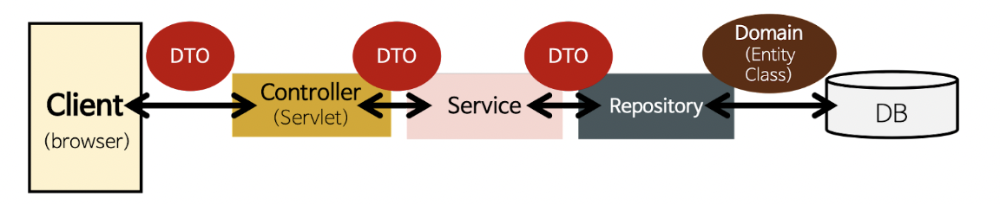

# DTO

## 목차

[1. DTO](#1-dto)

[2. DTO 장점](#2-dto-장점)
- [2.1. 데이터 캡슐화](#21-데이터-캡슐화)
- [2.2. 보안성](#22-보안성)
- [2.3. 성능 최적화](#23-성능-최적화)
- [2.4. 유지보수](#24-유지보수)

[3. DTO 사용법](#3-dto-사용법)

## 1. DTO

Spring Boot에서 DTO(Data Transfer Object)는 계층 간의 데이터 전송을 위해 사용되는 객체입니다.



## 2. DTO 장점

DTO는 데이터의 전송을 단순화하고 보안, 성능, 유지보수 측면에서 많은 이점을 제공합니다.

### 2.1. 데이터 캡슐화

DTO는 데이터의 구조를 캡슐화하여 필요한 데이터만 노출합니다.

### 2.2. 보안성

불필요한 데이터 노출을 방지하여 보안을 강화할 수 있습니다.

### 2.3. 성능 최적화

필요한 데이터만 전송하여 네트워크 트래픽을 줄일 수 있습니다.

### 2.4. 유지보수

Entity와 독립적으로 설계되어 데이터 모델의 변경에 유연하게 대응할 수 있습니다.

## 3. DTO 사용법

DTO를 사용하는 일반적인 방법은 DTO 클래스를 정의하고, 계층 간의 데이터를 전송할 때 해당 DTO 클래스를 사용하는 방법입니다.

아래 예시 코드는 간단한 DTO 사용 예시로, User DTO 클래스를 정의하고 Controller에서 DTO 객체를 매개변수로 받는 예시입니다.

### User DTO 클래스

```
public class UserDto {
    private String name;
    private String age;
}
```

### Controller

```
@RestController
public class UserController {
    @PostMapping("api/users/signup")
    public ResponseEntity<User> signup(@RequestBody UserDto userDto) {
        // 코드 내용
    }
}
```