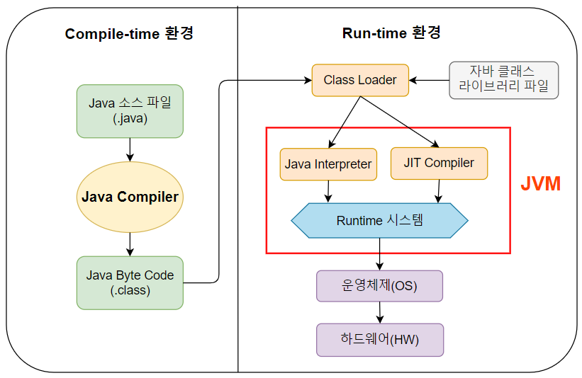

# TIL: Java 문법 종합반 1주차

Java 문법 종합반 1주차 강의에서는 2개의 Chapter를 학습하였다.

## 목차

[1. Chapter 1](#1-chapter-1)
- [1.1. Java의 탄생 배경](#11-java의-탄생-배경)
- [1.2. Java를 배우는 이유](#12-java를-배우는-이유)
- [1.3. JVM](#13-jvm)
- [1.4. JDK](#14-jdk)
- [1.5. Intellij](#15-intellij)

[2. Chapter 2](#2-chapter-2)
- [2.1. 변수](#21-변수)
- [2.2. 변수의 타입](#22-변수의-타입)
- [2.3. 변수의 형변환](#23-변수의-형변환)

[3. 마무리](#3-마무리)

## 1. Chapter 1

Chapter 1은 Java의 탄생 배경, Java를 배우는 이유, JVM, JDK, Intellij에 대해서 배웠다.

### 1.1. Java의 탄생 배경

Java의 탄생 배경에서는 개발 언어의 역사로 A언어 에서부터 C언어를 거쳐 현재 Java에 이르기까지의 과정과 Java 언어의 기능에 대해서 배웠다.

### 1.2. Java를 배우는 이유

Java를 배우는 5가지 이유를 한 번씩 훑어보았고 그 내용은 아래와 같다.

- Java는 공통 실행환경이 있어서 여러 기기에서 실행할 수 있다.
- Java는 세상과 닮아있는 개발 언어라 코드를 이해하기 쉽고 유지 보수가 쉽다.
- Java는 안정성이 높아서 프로그래밍 오류를 방지하고 보안상 안전하다.
- 대규모 앱 개발이 가능하다.
- Java를 배우면 다양한 개발 도구와 라이브러리를 사용할 수 있다.

### 1.3. JVM

JVM이 무엇인지, JVM의 구성이 어떻게 되어있는지에 대해서 배웠다.

### 1.4. JDK

JDK이 무엇인지와 Window에 JDK를 설치하는 방법에 대해서 배웠다.

### 1.5. Intellij

Intellij 설치를 진행한 후 JDK를 활용한 디버깅, System.out.print & println 을 실습해보았다. 
마지막으로 main 메서드에 대한 설명을 간단하게 들었다.

## 2. Chapter 2

Chapter 2는 변수, 변수의 타입, 타입의 형 변환에 대해서 배웠다.

### 2.1. 변수

Java 변수의 선언과 할당에 대해서 배우고 상수라는 개념에 대해서 배웠다.

### 2.2. 변수의 타입

Java 변수의 타입에는 기본형, 참조형 변수가 있다는 걸 배웠다. 
또한 숫자를 문자로, 문자를 숫자로 바꾸는 방법과 문자와 문자열이 어떻게 다른지, 참조형 변수가 메모리의 Stack과 Heap 영역에 어떻게 저장되는지도 배웠다.

### 2.3. 변수의 형변환

변수의 형 변환에 대해 학습하였고 정수와 실수 간의 형 변환에 대해서 실습을 하였다. 
또한 자동 형 변환, 강제 형 변환에 대해서 배웠다.

## 3. 마무리

아직은 Java의 기본 문법이 어색하고 JS와 헷갈린다. 
큰 문맥은 비슷하지만, let과 const로 모든 걸 해결하던 JS와 달리 데이터 타입에 따라 일일이 변수의 타입을 써줘야 하는 Java가 조금 귀찮게도 느껴진다. 
하지만 새로운 언어를 배우는 게 설레고 기대되고 재미있다.

다만 강의에서 살짝 아쉬웠던 부분은 래퍼 클래스 변수에 대해서 설명할 때 Integer 클래스를 사용하였는데 따라 하려고 코드를 입력한 순간 빨간 밑줄... 에러 메시지를 확인해보니 9버전 이후부터 deprecated 되었다고 한다. 
강의에서 해당 부분이 왜 deprecated 되었고 deprecated 되었다면 Integer 클래스 대신에 무엇을 사용하는지 알려주었으면 조금 더 좋았을 거 같다.