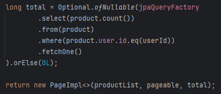
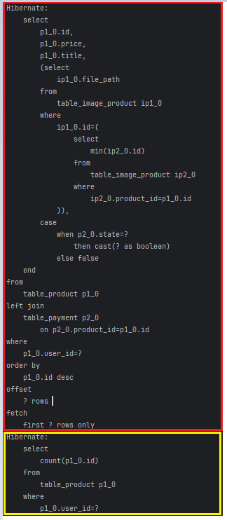
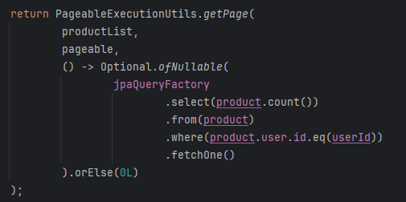
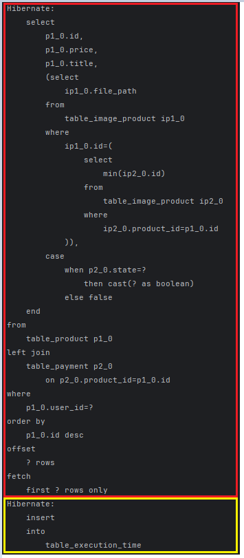

# PageableExecutionUtils.getPage()

## 목차

[문제 상황](#문제-상황)

[PageableExecutionUtils.getPage() 소개](#pageableexecutionutilsgetpage-소개)

[PageableExecutionUtils.getPage() 사용 이유](#pageableexecutionutilsgetpage-사용-이유)

[PageImpl(), PageableExecutionUtils.getPage() 쿼리 실행 비교](#pageimpl-pageableexecutionutilsgetpage-쿼리-실행-비교)

[결론](#결론)

## 문제 상황

현재 프로젝트에서는 QueryDSL을 사용해 페이징 처리를 하며, new PageImpl()을 통해 Page 객체를 반환하고 있었습니다.

QueryDSL 성능 테스트를 진행하는 과정에서 하이버네이트가 SQL 쿼리를 두 번 실행하는 문제를 발견했습니다.

이는 new PageImpl()이 본문 데이터를 조회한 후 항상 count 쿼리도 추가로 실행하기 때문입니다.

new PageImpl()은 본문 데이터 조회와 전체 데이터 수를 구하는 두 가지 쿼리를 모두 실행하므로, 불필요한 count 쿼리가 매번 발생할 수 있습니다.

이를 개선하기 위한 방법을 찾던 중, PageableExecutionUtils.getPage()라는 유틸리티 메서드를 알게 되었습니다.

## PageableExecutionUtils.getPage() 소개

PageableExecutionUtils.getPage()는 필요할 때에만 count 쿼리를 실행함으로써 불필요한 쿼리 실행을 줄이고, 성능을 최적화할 수 있도록 도와줍니다.

new PageImpl()은 항상 count 쿼리를 실행하는 반면, PageableExecutionUtils.getPage()는 페이지 크기와 데이터 상황을 고려하여 count 쿼리 실행 여부를 결정합니다.

PageableExecutionUtils.getPage()는 **페이지 크기가 전체 데이터 수보다 크거나 같은 경우** count 쿼리 실행을 생략할 수 있습니다.

예를 들어, 데이터가 10개이고 페이지 크기가 10 이상일 경우 count 쿼리를 실행하지 않습니다.

## PageableExecutionUtils.getPage() 사용 이유

현재 프로젝트에서는 내가 등록한 게시글, 상품 또는 내가 찜한 상품의 데이터가 페이지 크기보다 작을 수 있으며, 상품을 판매하지 않은 유저의 경우 상점 후기가 아예 없을 수도 있습니다.

이러한 경우에는 count 쿼리를 실행하는 것이 불필요하기 때문에, PageableExecutionUtils.getPage()를 통해 쿼리 수를 줄이고 성능을 개선할 수 있습니다.

## PageImpl(), PageableExecutionUtils.getPage() 쿼리 실행 비교

### PageImpl()

- **하이버네이트 결과**

**PageImpl()** 의 경우 빨간색 박스의 본문 데이터 조회 쿼리와 노란색 박스의 count 쿼리가 발생하는 걸 확인할 수 있습니다.

### PageableExecutionUtils.getPage()

- **하이버네이트 결과**

**PageableExecutionUtils.getPage()** 의 경우 빨간색 박스의 본문 데이터 조회 쿼리 이후에 count 쿼리가 발생하지 않고 노란색 박스의 다른 작업을 수행하는 걸 확인할 수 있습니다.

## 결론

PageableExecutionUtils.getPage()는 QueryDSL과 함께 사용할 때, 불필요한 count 쿼리를 줄여 성능 최적화를 도울 수 있습니다.

프로젝트의 데이터 구조와 페이지 크기를 고려해 적절하게 적용하면, 쿼리 실행 횟수를 줄여서 성능을 향상시킬 수 있습니다.