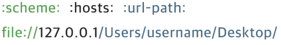
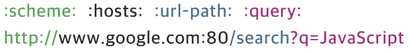
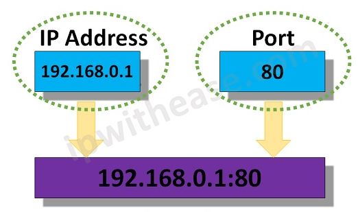

# TIL: URL & URI

웹개발 종합반 3주차 수업에서 URL에 대해서 살짝 다루고 넘어가 추가로 공부한 TIL 글입니다.

## 목차

[1. URL](#1-url)
- [1.1. scheme](#11-scheme)
- [1.2. hosts](#12-hosts)
- [1.3. url-path](#13-url-path)

[2. URI](#2-uri)
- [2.1. query](#21-query)

[3. 네트워크 주소](#3-네트워크-주소)
- [3.1. IP](#31-ip)
- [3.2. PORT](#32-port)
- [3.3. 도메인](#33-도메인)
- [3.4. DNS](#34-dns)

## 1. URL

URL(Uniform Resource Locator)은 네트워크 상에서 웹 페이지, 이미지, 동영상 등의 파일이 위치한 정보를 나타낸다.

URL은 scheme, hosts, url-path로 구분할 수 있다.

### 1.1. scheme

scheme는 통신 방식(프로토콜)을 결정한다. 
일반적인 웹 브라우저에서는 http 또는 https를 사용한다.

### 1.2. hosts

hosts는 웹 서버의 이름이나 도메인, IP를 사용하며 주소를 나타낸다.

### 1.3. url-path

url-path는 웹 서버에서 지정한 루트 디렉토리부터 시작하여 웹 페이지, 이미지, 동영상 등이 위치한 경로와 파일명을 타나낸다.

## 2. URI

URI(Uniform Resource Identifier)는 URL의 기본 요소인 scheme, hosts, url-path에 더해 query를 포함한다.

### 2.1. query

query는 웹 서버에 보내는 추가적인 질문으로 query를 사용하기 위해 ? 기호를 사용한다. 
만약 파라미터가 여러개일 경우 & 기호를 붙여서 사용할 수 있다.

## 3. 네트워크 주소

네트워크 주소는 컴퓨터 네트워크에서 각 네트워크를 식별하는 데 사용되는 고유한 주소이다.

### 3.1. IP

IP(Internet Protocol)는 인터넷에서 데이터를 주고받기 위한 주소 체계로 각 컴퓨터나 장치가 고유한 식별자를 갖도록 하는데 이를 IP 주소라고 한다.

#### 3.1.1. IPv4

IPv4(Internet Protocol version 4)는 IP 주소 체계의 네 번째 버전을 뜻하며, IPv4 주소는 보통 4개의 0부터 255까지의 숫자로 표현된다.

### 3.2. PORT

PORT는 IP 주소 끝 콜론(:) 다음에 오는 숫자로 IP 주소에 진입할 수 있는 정해진 통로를 의미한다.

PORT 번호는 0 ~ 65,535 까지 사용할 수 있으며 그 중에서 0 ~ 1024 까지의 PORT 번호는 주요 통신을 위한 규약에 따라 이미 정해져 있다.

이미 사용 중인 PORT는 중복해서 사용할 수 없으며 잘 알려진 PORT의 경우 URI 등에 명시하지 않지만 그 외의 잘 알려지지 않은 PORT는 반드시 포함해야 한다.

잘 알려진 PORT 번호로는 80번 HTTP, 443번 HTTPS, 22번 SSH 등이 있다.

### 3.3. 도메인

도메인(Domain)은 웹 브라우저를 통해 특정 사이트에 진입할 때 IP 주소를 대신하여 사용하는 주소를 의미한다.

### 3.4. DNS

DNS(Domain Name System)는 호스트의 도메인 이름을 IP 주소로 변환하거나 반대의 경우를 수행할 수 있도록 개발된 데이터베이스 시스템이다.