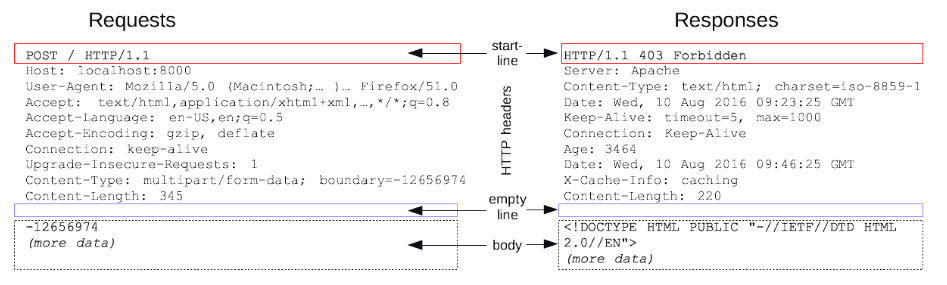

# TIL: HTTP

웹개발 종합반 3주차 수업에서 Get 요청에 대한 언급이 있어 HTTP 요청 메서드에 대해서 공부하다 HTTP에 대해 알게 되었고 해당 내용을 공부한 TIL 글입니다.

## 목차

[1. HTTP](#1-http)
- [1.1. 무상태성]()

[2. HTTP Messages](#2-http-messages)

[3. HTTP 요청 메서드](#3-http-요청-메서드)
- [3.1. GET](#31-get)
- [3.2. POST](#32-post)
- [3.3. PUT](#33-put)
- [3.4. PATCH](#34-patch)
- [3.5. DELETE](#35-delete)

[4. HTTP 상태 코드](#4-http-상태-코드)

## 1. HTTP

HTTP(HyperText Transfer Protocol)는 HTML과 같은 문서를 전송하기 위한 Application Layer 프로토콜이다.

HTTP는 웹 브라우저와 웹 서버의 소통을 위해 디자인 되었다.

HTTP는 특정 상태를 유지하지 않는 특징이 있으며 이를 무상태성(Stateless)이라고 한다.

### 1.1. 무상태성

무상태성(Stateless)은 말 그대로 상태를 가지지 않는다는 뜻으로 클라이언트와 서버 간 통신 과정에서 HTTP가 상태를 유지하지 않는다는 뜻이다. 
이는 각각의 요청이 독립적으로 처리되며 이전 요청에 대한 정보를 서버가 유지하지 않는다는 것을 의미한다.

## 2. HTTP Messages

HTTP Messages는 클라이언트와 서버 사이에서 데이터가 교환되는 방식으로 요청(Requests)과 응답(Responses) 두 가지 유형이 있다.

클라이언트가 HTTP Messages 양식에 맞춰 요청을 보내면 서버도 HTTP Messages 양식에 맞춰 응답한다.

요청(Requests)과 응답(Responses)은 start(status) line, HTTP headers, empty line, body의 구조를 가진다.

> start(status) line

start line은 항상 첫 번째 줄에 위치하며 응답에서는 status line이라고 부른다.

start(status) line에는 요청이나 응답의 상태를 나타낸다.

> HTTP headers

요청을 지정하거나 메시지에 포함된 본문을 설명하는 헤더의 집합이다.

> empty line

헤더와 본문을 구분하는 빈 줄이다.

> body

요청과 관련된 데이터나 응답과 관련된 데이터 또는 문서를 포함한다.

요청과 응답의 유형에 따라 선택적으로 사용한다.

## 3. HTTP 요청 메서드

HTTP 요청 메서드는 클라이언트가 서버에게 요청을 보낼 때 사용하는 명령어이다.

요청 메서드는 클라이언트가 서버에게 어떤 동작을 원하는지를 나타내며 서버는 이에 따라 적절한 응답을 제공한다.

HTTP 요청 메서드는 여러개가 있지만 여기에서는 자주 사용하는 GET, POST, PUT, PATCH, DELETE에 대해서만 다룬다.

### 3.1. GET

서버로부터 특정 데이터를 요청하는 메서드로 주로 정보를 요청할 때 사용된다.

### 3.2. POST

서버에 데이터를 제출하는 메서드로 주로 웹 양식(form)의 데이터를 서버로 제출하거나, 리소스를 생성할 때 사용된다.

### 3.3. PUT

서버에 새로운 데이터를 생성하거나, 기존 리소스를 업데이트할때 사용된다.

### 3.4. PATCH

서버에 데이터의 일부를 수정하도록 요청하는 메서드로 주어진 데이터의 일부만 업데이트할 때 사용된다.

### 3.5. DELETE

서버에서 특정 데이터를 삭제하는 메서드이다.

## 4. HTTP 상태 코드

상태 코드는 사용자가 웹 서버에 요청을 보냈을 때 응답으로 보내주는 숫자 코드이다.

각 숫자는 미리 약속된 특정한 의미를 포함하고 있어 클라이언트는 응답으로 온 숫자를 통해 보낸 요청의 성공 여부와 의미를 알 수 있다.

200번대 상태 코드는 요청 성공을 의미하고 400번대, 500번대 상태 코드는 요청 실패를 의미한다.

> 200 OK

에러 없이 요청이 성공적으로 진행되었을 때 상태 코드로 대표적인 성공 상태 코드이다.

> 201 Created

요청이 성공적으로 처리되어 서버가 새로운 리소스를 생성하였을 때 상태 코드이다.

> 204 No Content

요청이 성공적으로 처리되었지만 제공 해줄 데이터가 없을 때 상태 코드이다.

> 400 Bad Request

API에 정의되지 않은 방식으로 요청을 하는 등 클라이언트가 잘못된 요청을 했을 때 상태 코드이다.

> 401 Unauthorized

클라이언트가 인증 권한이 없어서 요청을 받아들일 수 없을 때 상태 코드이다.

> 403 Forbidden

클라이언트가 권한이 없어서 요청을 받아들일 수 없을 때 상태 코드이다.

> 404 Not Found

클라이언트가 요청한 리소스를 서버에서 찾을 수 없을 때 상태 코드이다.

> 500 Internal Server Error

클라이언트의 요청이 잘못된 것이 아니라 서버측에서 문제가 생겼을 때 상태 코드이다.