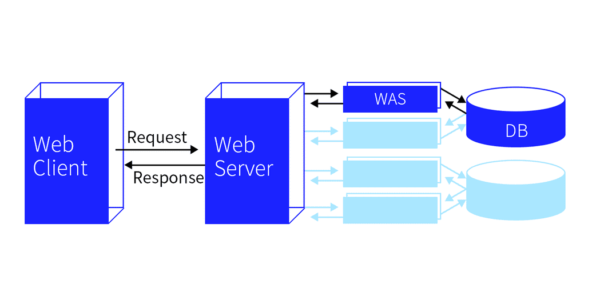

# TIL: 웹개발 종합반 1주차

오늘은 사전캠프에서 처음으로 강의를 듣기 시작하였다.

강의 내용은 웹개발 종합반 1주차로 **웹 브라우저 작동 원리**, **HTML**, **CSS**에 대해서 배웠다.

## 목차

[1. 웹 브라우저 작동 원리](#1-웹-브라우저-작동-원리1.-웹-브라우저-작동-원리)

- [1.1. 서버(Server)와 클라이언트(Client)](#11-서버server와-클라이언트client)

[2. HTML](#2-html)

[3. CSS](#3-css)

## 1. 웹 브라우저 작동 원리

웹 브라우저의 작동 원리는 사용자가 참조하고자 하는 웹 페이지를 서버에 요청(Request)하고 서버의 응답(Response)을 받아 브라우저에 표시하는 것이다.

### 1.1. 서버(Server)와 클라이언트(Client)

서버(Server)는 네트워크를 통해 다른 컴퓨터나 소프트웨어와 같은 클라이언트에게 서비스를 제공하는 컴퓨터를 말한다.

클라이언트(Client)는 서버로 서비스나 데이터를 요청하고 요청한 서비스나 데이터를 받는 컴퓨터 또는 스프트웨어를 말한다.

## 2. HTML

강의에서는 HTML이 대략적으로 무엇인지에 대해서만 배웠는데 내용이 너무 빈약하여 아쉬웠다.

강의 외에 추가적으로 HTML에 대해서 공부하고 해당 내용은 HTML 폴더를 만들고 TIL을 작성해야 겠다.

[HTML](../HTML/HTML%20%EA%B8%B0%EC%B4%88.md)

## 3. CSS

강의에서 CSS에 대해서 여러가지 내용을 배워 이곳에 다 담기에는 보는것이 복잡할 것 같다.

또 추가적으로 CSS에 대해서 학습할 내용이 있을거 같아 강의 내용과 추가 학습 내용은 CSS 폴더를 만들고 TIL을 작성해야 겠다.

[CSS](../CSS/CSS%20%EA%B8%B0%EC%B4%88.md)